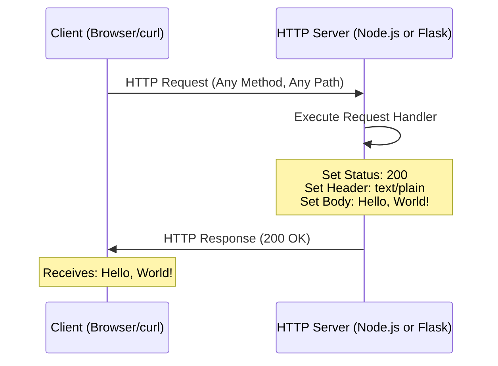

# hao-backprop-test

A minimal HTTP server implementation available in both **Node.js** and **Python Flask**, designed for backprop integration testing. This project demonstrates a simple "Hello, World!" server in two popular languages:

- **Node.js version** (`server.js`): Zero external dependencies, uses only Node.js core `http` module
- **Python Flask version** (`app.py`): Minimal Flask implementation with identical functionality

Both implementations provide identical behavior and API responses, allowing you to choose based on your preferred technology stack.

## Table of Contents

- [Features](#features)
- [Choosing an Implementation](#choosing-an-implementation)
- [Prerequisites](#prerequisites)
- [Installation](#installation)
- [Quick Start](#quick-start)
- [Usage](#usage)
- [API Reference](#api-reference)
- [How It Works](#how-it-works)
- [Configuration](#configuration)
- [Security](#security)
- [Deployment](#deployment)
- [Testing](#testing)
- [Troubleshooting](#troubleshooting)
- [Development](#development)
- [Contributing](#contributing)
- [License](#license)
- [Author](#author)

## Features

- **Dual Implementation**: Available in both Node.js and Python Flask - choose your preferred stack
- **Lightweight HTTP Server**: Minimal implementation in both languages
- **Node.js Version**: Zero external dependencies - uses only built-in `http` module
- **Python Flask Version**: Minimal Flask dependency with clean, Pythonic code
- **Single-File Implementations**: Complete server in one file per language - easy to understand
- **Identical Behavior**: Both implementations provide the exact same API and responses
- **Simple Endpoint**: Returns "Hello, World!" response to all requests
- **Easy to Understand**: Perfect for learning HTTP server basics in Node.js or Python
- **Easy to Modify**: Clean, straightforward code structure ideal for customization

## Choosing an Implementation

This project provides two functionally identical HTTP server implementations. Choose based on your needs:

### Node.js Version (`server.js`)

**Choose this if you:**
- Prefer JavaScript/Node.js ecosystem
- Want zero external dependencies (only Node.js runtime required)
- Need the absolute minimal setup (no package installation)
- Are learning Node.js HTTP server basics

**Pros:**
- No `npm install` required
- Smaller footprint (no dependencies)
- Native async/event-driven architecture
- Faster startup time

### Python Flask Version (`app.py`)

**Choose this if you:**
- Prefer Python ecosystem
- Are more comfortable with Python syntax
- Want to extend with Python's extensive libraries
- Are learning Flask web framework basics

**Pros:**
- Cleaner, more readable Python syntax
- Easy integration with Python data science/ML tools
- Extensive Flask ecosystem for future expansion
- Strong typing support with type hints

### Functional Equivalence

Both implementations provide:
- Identical HTTP responses (status 200, text/plain, "Hello, World!")
- Same binding (127.0.0.1:3000 by default)
- Same console output on startup
- Same behavior for all HTTP methods and paths

**You can use either one interchangeably based on your preference.**

## Prerequisites

### For Node.js Version

- **Node.js**: Version 14.0.0 or higher (tested with v22.21.0)
  - Download from [nodejs.org](https://nodejs.org/)
- **npm**: Comes bundled with Node.js

**Verify Installation:**

```bash
node --version
# Expected output: v14.0.0 or higher

npm --version
# Expected output: 6.0.0 or higher
```

### For Python Flask Version

- **Python 3**: Version 3.8 or higher (tested with v3.12.3)
  - Download from [python.org](https://www.python.org/)
- **pip**: Python package installer (comes with Python 3.4+)
- **Virtual environment** (recommended): `python3 -m venv`

**Verify Installation:**

```bash
python3 --version
# Expected output: Python 3.8.0 or higher

pip3 --version
# Expected output: pip 20.0.0 or higher
```

### Common Requirements (Both Versions)

- **Command Line Knowledge**: Basic familiarity with terminal/command prompt
- **curl** (optional): For testing HTTP endpoints from the command line

## Installation

### Step 1: Clone the Repository

```bash
git clone <repository-url>
cd hao-backprop-test
```

### Step 2: Choose Your Implementation

#### Option A: Node.js Version (Zero Dependencies)

**Verify Node.js Installation:**

```bash
node --version
# Expected: v14.0.0 or higher
```

**No additional installation needed!** The Node.js version uses only built-in modules.

```bash
# No need to run npm install - there are no dependencies!
```

#### Option B: Python Flask Version

**Verify Python Installation:**

```bash
python3 --version
# Expected: Python 3.8.0 or higher
```

**Create Virtual Environment (Recommended):**

```bash
# Create virtual environment
python3 -m venv venv

# Activate virtual environment
# On Linux/macOS:
source venv/bin/activate

# On Windows:
venv\Scripts\activate
```

**Install Dependencies:**

```bash
pip install -r requirements.txt
# Installs Flask and dependencies
```

**Verify Flask Installation:**

```bash
python3 -c "import flask; print(f'Flask {flask.__version__} installed')"
# Expected: Flask 3.1.0 installed
```

## Quick Start

### Node.js Version

Get the Node.js server running:

```bash
# Start the server
node server.js

# Output: Server running at http://127.0.0.1:3000/
```

### Python Flask Version

Get the Flask server running:

```bash
# Activate virtual environment (if using one)
source venv/bin/activate  # Linux/macOS
# OR: venv\Scripts\activate  # Windows

# Start the server
python3 app.py

# Output: Server running at http://127.0.0.1:3000/
```

### Testing Either Version

In another terminal window:

```bash
# Test the server
curl http://127.0.0.1:3000/

# Expected output
Hello, World!
```

That's it! Your server is now running and responding to requests.

## Usage

### Starting the Server

#### Node.js Version

Run the server using Node.js:

```bash
node server.js
```

Expected console output:
```
Server running at http://127.0.0.1:3000/
```

#### Python Flask Version

Run the server using Python:

```bash
# Activate virtual environment first (if using one)
source venv/bin/activate  # Linux/macOS
# OR: venv\Scripts\activate  # Windows

# Start the server
python3 app.py
```

Expected console output:
```
Server running at http://127.0.0.1:3000/
 * Serving Flask app 'app'
 * Debug mode: off
WARNING: This is a development server. Do not use it in a production deployment. Use a production WSGI server instead.
 * Running on http://127.0.0.1:3000
Press CTRL+C to quit
```

**Note:** The Flask development server shows additional warnings about production deployment, which is normal for development.

Both servers listen on `localhost` (127.0.0.1) at port 3000.

### Stopping the Server

To stop either server, press:

```bash
Ctrl+C
```

(or `Cmd+C` on macOS)

### Changing Port or Hostname

#### For Node.js (`server.js`)

Modify the constants:

```javascript
const hostname = '127.0.0.1';  // Change to '0.0.0.0' for external access
const port = 3000;              // Change to your preferred port
```

#### For Python Flask (`app.py`)

Modify the constants:

```python
HOSTNAME = '127.0.0.1'  # Change to '0.0.0.0' for external access
PORT = 3000              # Change to your preferred port
```

Or set environment variables (requires code modification to read from `os.environ`).

## API Reference

**Both Node.js and Python Flask implementations provide identical API responses.**

### Base URL

```
http://127.0.0.1:3000
```

### Endpoints

| Method | Path | Description | Response |
|--------|------|-------------|----------|
| ALL | `/*` | Returns greeting message | `200 OK`, `text/plain`, `"Hello, World!\n"` |

#### Endpoint: ALL /*

**Description:** Responds with "Hello, World!" to all HTTP requests regardless of method or path.

**Request:**
- **Methods**: GET, POST, PUT, DELETE, PATCH, OPTIONS, HEAD (all methods accepted)
- **URL**: Any path (e.g., `/`, `/test`, `/api/users`)
- **Headers**: None required

**Response (Identical for Both Implementations):**
- **Status Code**: 200 OK  
  *Node.js Source: `/server.js:51`*  
  *Python Source: `/app.py:47-49`*
- **Content-Type**: text/plain  
  *Node.js Source: `/server.js:52`*  
  *Python Source: `/app.py:49`*
- **Body**: `Hello, World!\n`  
  *Node.js Source: `/server.js:53`*  
  *Python Source: `/app.py:48`*

**Example Requests:**

Using **curl**:
```bash
curl http://127.0.0.1:3000/
# Output: Hello, World!

curl http://127.0.0.1:3000/any/path
# Output: Hello, World!
```

Using **JavaScript fetch**:
```javascript
fetch('http://127.0.0.1:3000/')
  .then(response => response.text())
  .then(data => console.log(data));
// Output: Hello, World!
```

Using a **web browser**:
```
Open: http://127.0.0.1:3000/
Displays: Hello, World!
```

## How It Works

### Architecture Overview

Both implementations follow a simple HTTP request/response cycle:

- **Node.js version**: Uses Node.js's built-in `http` module with event-driven callbacks
- **Python Flask version**: Uses Flask's routing decorators with WSGI application framework

Every incoming request is handled by a single function that sends the same response, regardless of HTTP method or path.

### Request Flow Diagram (Both Implementations)



Both implementations follow the same flow, differing only in implementation details.

### Code Walkthrough

#### Node.js Implementation (`server.js`)

**1. Import the HTTP Module**
```javascript
const http = require('http');
```
Imports Node.js's built-in HTTP module for creating web servers.  
*Source: `/server.js:12`*

**2. Define Server Configuration**
```javascript
const hostname = '127.0.0.1';  // Localhost IPv4 address
const port = 3000;              // Default development port
```
Configures where the server listens. `127.0.0.1` restricts access to the local machine.  
*Source: `/server.js:22,32`*

**3. Create HTTP Server with Request Handler**
```javascript
const server = http.createServer((req, res) => {
  res.statusCode = 200;
  res.setHeader('Content-Type', 'text/plain');
  res.end('Hello, World!\n');
});
```
Creates a server instance with a callback function that:
- Sets HTTP status to 200 (OK)
- Sets response content type to plain text
- Sends "Hello, World!" and closes the connection

*Source: `/server.js:50-54`*

**4. Start Listening for Connections**
```javascript
server.listen(port, hostname, () => {
  console.log(`Server running at http://${hostname}:${port}/`);
});
```
Binds the server to the specified hostname and port, then logs a confirmation message.  
*Source: `/server.js:64-66`*

#### Python Flask Implementation (`app.py`)

**1. Import Flask and Response**
```python
from flask import Flask, Response
```
Imports Flask web framework and Response class for creating HTTP responses.  
*Source: `/app.py:11`*

**2. Define Server Configuration**
```python
HOSTNAME = '127.0.0.1'  # Localhost IPv4 address
PORT = 3000              # Default development port
```
Configures where the server listens. `127.0.0.1` restricts access to the local machine.  
*Source: `/app.py:16,21`*

**3. Create Flask Application**
```python
app = Flask(__name__)
```
Creates a Flask application instance.  
*Source: `/app.py:24`*

**4. Define Route Handler (All Paths, All Methods)**
```python
@app.route('/', defaults={'path': ''}, methods=['GET', 'POST', 'PUT', 'DELETE', 'PATCH', 'OPTIONS', 'HEAD'])
@app.route('/<path:path>', methods=['GET', 'POST', 'PUT', 'DELETE', 'PATCH', 'OPTIONS', 'HEAD'])
def hello_world(path=''):
    return Response(
        'Hello, World!\n',
        status=200,
        mimetype='text/plain'
    )
```
Defines a route handler that:
- Catches all HTTP methods (GET, POST, PUT, DELETE, etc.)
- Catches all paths (/, /test, /any/path)
- Returns Response with status 200, text/plain type, and "Hello, World!" body

*Source: `/app.py:27-50`*

**5. Start Server**
```python
if __name__ == '__main__':
    print(f'Server running at http://{HOSTNAME}:{PORT}/')
    app.run(host=HOSTNAME, port=PORT, debug=False, use_reloader=False, threaded=True)
```
Starts the Flask development server on the specified hostname and port.  
*Source: `/app.py:53-61`*

### Key Concepts

#### Node.js Architecture
- **Event-Driven Architecture**: Uses callbacks to handle requests asynchronously
- **Single-Threaded**: One process handles all requests using the event loop
- **Non-Blocking I/O**: Efficient handling of concurrent requests

#### Python Flask Architecture
- **WSGI Application**: Python Web Server Gateway Interface standard
- **Request Context**: Flask manages request and response objects
- **Threaded**: Handles concurrent requests with threading (threaded=True)

#### Common Concepts (Both)
- **Stateless Server**: Each request is independent with no session management
- **Simple Response**: Same response for every request regardless of path or method
- **Development Server**: Built-in servers suitable for development, not production

## Configuration

### Hostname Configuration

**Default Value**: `127.0.0.1` (localhost) for both implementations  
*Node.js Source: `/server.js:22`*  
*Python Source: `/app.py:16`*

**Options:**
- `127.0.0.1` - Only accessible from local machine (development)
- `0.0.0.0` - Accessible from any network interface (production)
- Specific IP - Bind to a specific network interface

**How to Change:**

For Node.js (`server.js`):
```javascript
const hostname = '0.0.0.0';  // Allow external connections
```

For Python Flask (`app.py`):
```python
HOSTNAME = '0.0.0.0'  # Allow external connections
```

### Port Configuration

**Default Value**: `3000` for both implementations  
*Node.js Source: `/server.js:32`*  
*Python Source: `/app.py:21`*

**Common Ports:**
- `3000` - Common development port (both Node.js and Python)
- `5000` - Flask default port (alternative for Python)
- `8000`, `8080` - Alternative development ports
- `80` - HTTP (requires root/admin privileges)
- `443` - HTTPS (requires root/admin privileges)

**How to Change:**

For Node.js (`server.js`):
```javascript
const port = 8080;  // Use port 8080 instead
```

For Python Flask (`app.py`):
```python
PORT = 8080  # Use port 8080 instead
```

### Environment Variables (Future Enhancement)

**For Node.js:**
```javascript
const hostname = process.env.HOST || '127.0.0.1';
const port = process.env.PORT || 3000;
```

Then run with:
```bash
PORT=8080 HOST=0.0.0.0 node server.js
```

**For Python Flask:**
```python
import os
HOSTNAME = os.environ.get('HOST', '127.0.0.1')
PORT = int(os.environ.get('PORT', 3000))
```

Then run with:
```bash
PORT=8080 HOST=0.0.0.0 python3 app.py
```

## Security

### Security Overview

This project demonstrates a minimal HTTP server implementation. While suitable for learning and testing, production deployments require additional security measures.

### Current Security Posture

#### Strengths

✅ **Zero External Dependencies**
- No third-party npm packages means zero supply chain attack surface
- No dependency vulnerabilities to patch or monitor
- Reduced risk from compromised packages
- *Source: `/package.json` - no dependencies field*

✅ **Minimal Attack Surface**
- Single-file implementation (~15 lines of code)
- Limited functionality = fewer potential vulnerabilities
- Easy to audit and review for security issues

✅ **Localhost Binding by Default**
- Default `hostname: '127.0.0.1'` restricts access to local machine only
- Prevents unauthorized external network access in development
- *Source: `/server.js:22`*

✅ **Stateless Design**
- No session management or state storage
- No authentication/authorization complexity
- No database connections to secure

#### Current Limitations

⚠️ **No HTTPS/TLS Support**
- Traffic is unencrypted (plain HTTP)
- Vulnerable to man-in-the-middle attacks
- Credentials/sensitive data would be exposed if transmitted

⚠️ **No Input Validation**
- Server accepts all requests without validation
- Suitable for this simple example, but risky for real applications

⚠️ **No Rate Limiting**
- Vulnerable to denial-of-service attacks
- No protection against request flooding

⚠️ **No Security Headers**
- Missing security headers (CSP, HSTS, X-Frame-Options, etc.)
- Browser-side protections not implemented

⚠️ **No Request Logging**
- No audit trail for security monitoring
- Difficult to detect or investigate attacks

### Security Best Practices

#### 1. Network Exposure

**Development (Current Configuration):**
```javascript
const hostname = '127.0.0.1';  // ✅ Secure - localhost only
const port = 3000;              // ✅ Safe - non-privileged port
```

**Production (Requires Careful Configuration):**
```javascript
const hostname = '0.0.0.0';     // ⚠️ Exposes to all network interfaces
const port = process.env.PORT || 3000;
```

**⚠️ Warning:** Binding to `0.0.0.0` makes the server accessible from any network interface. Only use this when:
- Behind a firewall or security group
- Behind a reverse proxy (nginx, Apache)
- In a trusted network environment
- With proper authentication implemented

#### 2. Privileged Ports

**Security Risk:**
```javascript
const port = 80;   // ❌ Requires root/admin privileges
const port = 443;  // ❌ Requires root/admin privileges
```

**Best Practice:**
- **Never run Node.js as root** in production
- Use ports above 1024 (e.g., 3000, 8080, 8443)
- Use a reverse proxy (nginx/Apache) to handle ports 80/443
- Or use port forwarding: `sudo iptables -t nat -A PREROUTING -p tcp --dport 80 -j REDIRECT --to-port 3000`

#### 3. HTTPS/TLS Implementation

For production, implement HTTPS to encrypt traffic:

**Option A: Using Node.js HTTPS Module**
```javascript
const https = require('https');
const fs = require('fs');

const options = {
  key: fs.readFileSync('/path/to/private-key.pem'),
  cert: fs.readFileSync('/path/to/certificate.pem')
};

const server = https.createServer(options, (req, res) => {
  res.statusCode = 200;
  res.setHeader('Content-Type', 'text/plain');
  res.end('Hello, World!\n');
});

server.listen(443, '0.0.0.0', () => {
  console.log('Secure server running at https://0.0.0.0:443/');
});
```

**Option B: Using Reverse Proxy (Recommended)**
- Let nginx or Apache handle TLS termination
- Node.js server runs on localhost port 3000
- Reverse proxy handles SSL certificates, security headers, rate limiting

**Option C: Using Cloud Load Balancer**
- AWS ALB, Azure Application Gateway, GCP Load Balancer
- Managed TLS certificates (AWS Certificate Manager, Let's Encrypt)
- Built-in DDoS protection and WAF capabilities

#### 4. Security Headers

Add security headers to protect against common web vulnerabilities:

```javascript
const server = http.createServer((req, res) => {
  // Prevent clickjacking
  res.setHeader('X-Frame-Options', 'DENY');
  
  // Prevent MIME type sniffing
  res.setHeader('X-Content-Type-Options', 'nosniff');
  
  // Enable XSS protection
  res.setHeader('X-XSS-Protection', '1; mode=block');
  
  // Content Security Policy
  res.setHeader('Content-Security-Policy', "default-src 'self'");
  
  // Referrer Policy
  res.setHeader('Referrer-Policy', 'strict-origin-when-cross-origin');
  
  // Strict Transport Security (HTTPS only)
  // res.setHeader('Strict-Transport-Security', 'max-age=31536000; includeSubDomains');
  
  res.statusCode = 200;
  res.setHeader('Content-Type', 'text/plain');
  res.end('Hello, World!\n');
});
```

#### 5. Rate Limiting and DDoS Protection

Implement rate limiting to prevent abuse:

**Using Express Rate Limit (requires adding dependencies):**
```javascript
// Example only - would require npm install express express-rate-limit
const express = require('express');
const rateLimit = require('express-rate-limit');

const limiter = rateLimit({
  windowMs: 15 * 60 * 1000, // 15 minutes
  max: 100 // limit each IP to 100 requests per windowMs
});

app.use(limiter);
```

**Using Reverse Proxy Rate Limiting:**
- Configure nginx `limit_req_zone` and `limit_req`
- Use cloud provider rate limiting (AWS WAF, Cloudflare)
- Implement IP-based throttling at firewall level

#### 6. Input Validation and Sanitization

While this server doesn't process user input, real applications should:

```javascript
const server = http.createServer((req, res) => {
  // Validate request method
  const allowedMethods = ['GET', 'POST', 'HEAD'];
  if (!allowedMethods.includes(req.method)) {
    res.statusCode = 405;
    res.setHeader('Allow', allowedMethods.join(', '));
    res.end('Method Not Allowed\n');
    return;
  }
  
  // Validate path (prevent directory traversal)
  const url = new URL(req.url, `http://${req.headers.host}`);
  if (url.pathname.includes('..')) {
    res.statusCode = 400;
    res.end('Bad Request\n');
    return;
  }
  
  // Your application logic here
  res.statusCode = 200;
  res.setHeader('Content-Type', 'text/plain');
  res.end('Hello, World!\n');
});
```

#### 7. Security Monitoring and Logging

Implement logging for security monitoring:

```javascript
const server = http.createServer((req, res) => {
  // Log request details
  const timestamp = new Date().toISOString();
  const clientIP = req.socket.remoteAddress;
  const method = req.method;
  const url = req.url;
  const userAgent = req.headers['user-agent'] || 'unknown';
  
  console.log(`[${timestamp}] ${clientIP} ${method} ${url} - ${userAgent}`);
  
  // Your application logic
  res.statusCode = 200;
  res.setHeader('Content-Type', 'text/plain');
  res.end('Hello, World!\n');
  
  // Log response
  console.log(`[${timestamp}] Response: ${res.statusCode}`);
});
```

**Production Logging Best Practices:**
- Use structured logging (JSON format)
- Send logs to centralized logging service (ELK stack, Splunk, CloudWatch)
- Log security events: failed auth attempts, suspicious requests, errors
- Never log sensitive data (passwords, tokens, PII)
- Implement log rotation to prevent disk space issues

#### 8. Environment and Configuration Security

**Secure Configuration Management:**

```bash
# ❌ DON'T hardcode secrets in source code
const API_KEY = 'sk_live_abc123def456';

# ✅ DO use environment variables
const API_KEY = process.env.API_KEY;

# ✅ DO use .env files (and add to .gitignore)
# Create .env file:
echo "API_KEY=sk_live_abc123def456" > .env
echo "DATABASE_URL=postgres://..." >> .env

# Add to .gitignore:
echo ".env" >> .gitignore
```

**Environment Variable Validation:**
```javascript
// Validate required environment variables at startup
const requiredEnvVars = ['API_KEY', 'DATABASE_URL'];
const missing = requiredEnvVars.filter(name => !process.env[name]);

if (missing.length > 0) {
  console.error(`Missing required environment variables: ${missing.join(', ')}`);
  process.exit(1);
}
```

#### 9. Dependency Security (For Future Enhancements)

If you add npm dependencies in the future:

```bash
# Check for known vulnerabilities
npm audit

# Fix automatically where possible
npm audit fix

# Use npm ci for reproducible installs
npm ci

# Keep dependencies updated
npm outdated
npm update

# Use Snyk or Dependabot for automated vulnerability scanning
```

#### 10. Deployment Security Checklist

Before deploying to production:

- [ ] **Remove development configurations** (debug mode, verbose logging)
- [ ] **Use environment variables** for all configuration (no hardcoded values)
- [ ] **Implement HTTPS/TLS** encryption (or use reverse proxy/load balancer)
- [ ] **Add security headers** (CSP, HSTS, X-Frame-Options, etc.)
- [ ] **Implement rate limiting** to prevent DoS attacks
- [ ] **Set up monitoring and alerting** for security events
- [ ] **Configure firewall rules** (allow only necessary ports)
- [ ] **Run as non-root user** (never run Node.js as root)
- [ ] **Enable security groups** (AWS) or network security groups (Azure)
- [ ] **Implement request logging** for audit trails
- [ ] **Set up automated backups** (if applicable)
- [ ] **Use process manager** (PM2, systemd) for automatic restarts
- [ ] **Keep Node.js updated** to latest LTS version
- [ ] **Scan for vulnerabilities** (npm audit, Snyk, etc.)
- [ ] **Implement health checks** and graceful shutdown
- [ ] **Review and minimize exposed endpoints**
- [ ] **Use secrets manager** for sensitive credentials (AWS Secrets Manager, Azure Key Vault)
- [ ] **Enable CORS properly** (don't use `*` in production)
- [ ] **Implement authentication/authorization** if needed
- [ ] **Set up Web Application Firewall (WAF)** for additional protection

### Security Resources

**Node.js Security Best Practices:**
- [Node.js Security Best Practices](https://nodejs.org/en/docs/guides/security/)
- [OWASP Node.js Security Cheat Sheet](https://cheatsheetseries.owasp.org/cheatsheets/Nodejs_Security_Cheat_Sheet.html)
- [Express Security Best Practices](https://expressjs.com/en/advanced/best-practice-security.html)

**Security Tools:**
- [npm audit](https://docs.npmjs.com/cli/v8/commands/npm-audit) - Vulnerability scanning
- [Snyk](https://snyk.io/) - Dependency vulnerability monitoring
- [OWASP ZAP](https://www.zaproxy.org/) - Security testing
- [Let's Encrypt](https://letsencrypt.org/) - Free SSL/TLS certificates

**Security Standards:**
- [OWASP Top 10](https://owasp.org/www-project-top-ten/) - Most critical web security risks
- [CWE Top 25](https://cwe.mitre.org/top25/) - Most dangerous software weaknesses

### Reporting Security Vulnerabilities

If you discover a security vulnerability in this project:

1. **Do NOT create a public GitHub issue**
2. Contact the project maintainer privately
3. Provide detailed information about the vulnerability
4. Allow time for the issue to be addressed before public disclosure

### Disclaimer

This project is designed for **learning and testing purposes**. It is NOT production-ready out of the box. Implementing the security measures described above is YOUR responsibility when deploying to production environments.

## Deployment

### Local Development

**Node.js Version:**

```bash
node server.js
```

**Python Flask Version:**

```bash
# Activate virtual environment first
source venv/bin/activate  # Linux/macOS
python3 app.py
```

Simple and suitable for development and testing.

### Production Deployment

#### Option 1: Direct Execution (Basic)

**Node.js:**
```bash
# Run in foreground
node server.js

# Run in background (Linux/macOS)
nohup node server.js > server.log 2>&1 &
```

**Python Flask (NOT recommended for production):**
```bash
# Flask development server is NOT suitable for production
# Use Gunicorn or uWSGI instead (see Option 2)
```

**Limitations**: Process stops if terminal closes or errors occur. Flask development server is not production-ready.

#### Option 2: Process Manager (Recommended)

**For Node.js - PM2:**

PM2 keeps your application running, restarts on crashes, and provides monitoring.

```bash
# Install PM2 globally
npm install -g pm2

# Start the server with PM2
pm2 start server.js --name hello-world-server

# View running processes
pm2 list

# View logs
pm2 logs hello-world-server

# Restart
pm2 restart hello-world-server

# Stop
pm2 stop hello-world-server

# Make PM2 start on system boot
pm2 startup
pm2 save
```

**For Python Flask - Gunicorn:**

Gunicorn is a production-ready WSGI server for Python applications.

```bash
# Install Gunicorn in virtual environment
source venv/bin/activate
pip install gunicorn

# Start with Gunicorn (4 worker processes)
gunicorn -w 4 -b 127.0.0.1:3000 app:app

# Or with Gunicorn as daemon
gunicorn -w 4 -b 127.0.0.1:3000 app:app --daemon --pid gunicorn.pid

# Stop Gunicorn daemon
kill $(cat gunicorn.pid)

# Alternative: Use systemd service (production)
# Create /etc/systemd/system/hello-world-flask.service
```

#### Option 3: Docker Deployment

**For Node.js - Create `Dockerfile.node`:**

```dockerfile
FROM node:18-alpine

WORKDIR /app

COPY server.js .

EXPOSE 3000

CMD ["node", "server.js"]
```

**Build and run Node.js:**

```bash
# Build Docker image
docker build -f Dockerfile.node -t hello-world-node .

# Run container
docker run -d -p 3000:3000 --name hello-server-node hello-world-node

# View logs
docker logs hello-server-node

# Stop container
docker stop hello-server-node
```

**For Python Flask - Create `Dockerfile.python`:**

```dockerfile
FROM python:3.12-slim

WORKDIR /app

COPY requirements.txt .
RUN pip install --no-cache-dir -r requirements.txt

COPY app.py .

EXPOSE 3000

# Use Gunicorn for production
CMD ["gunicorn", "-w", "4", "-b", "0.0.0.0:3000", "app:app"]
```

**Build and run Python Flask:**

```bash
# Build Docker image
docker build -f Dockerfile.python -t hello-world-flask .

# Run container
docker run -d -p 3000:3000 --name hello-server-flask hello-world-flask

# View logs
docker logs hello-server-flask

# Stop container
docker stop hello-server-flask
```

#### Option 4: Cloud Platform Deployment

**Heroku (Node.js):**

```bash
# Create Heroku app
heroku create

# Add Procfile for Node.js
echo "web: node server.js" > Procfile

# Deploy
git push heroku main

# Open in browser
heroku open
```

**Heroku (Python Flask):**

```bash
# Create Heroku app
heroku create

# Add Procfile for Python
echo "web: gunicorn -w 4 -b 0.0.0.0:\$PORT app:app" > Procfile

# Ensure requirements.txt includes gunicorn
echo "gunicorn==21.2.0" >> requirements.txt

# Deploy
git push heroku main

# Open in browser
heroku open
```

**AWS Elastic Beanstalk (Node.js):**

1. Install AWS CLI and EB CLI
2. Initialize Elastic Beanstalk:
   ```bash
   eb init -p node.js
   eb create production-env
   eb open
   ```

**AWS Elastic Beanstalk (Python):**

1. Install AWS CLI and EB CLI
2. Initialize Elastic Beanstalk:
   ```bash
   eb init -p python-3.12
   eb create production-env
   eb open
   ```

**Azure App Service (Node.js):**

1. Install Azure CLI
2. Deploy:
   ```bash
   az webapp up --name hello-world-node --runtime "NODE:18-lts"
   ```

**Azure App Service (Python):**

1. Install Azure CLI
2. Deploy:
   ```bash
   az webapp up --name hello-world-flask --runtime "PYTHON:3.12"
   ```

### Environment Considerations

- **Development**: Use `hostname: '127.0.0.1'`, `port: 3000`
- **Production**: Consider `hostname: '0.0.0.0'`, use environment variable for `port`
- **Reverse Proxy**: Use nginx or Apache for production traffic handling
- **Process Manager**: Use PM2 or systemd for automatic restarts
- **Monitoring**: Add logging and error tracking services

## Testing

**Both implementations provide identical responses and can be tested the same way.**

### Manual Testing with curl

**Test the root endpoint:**
```bash
curl http://127.0.0.1:3000/
```

**Expected output (identical for both Node.js and Python):**
```
Hello, World!
```

**Test with different paths:**
```bash
curl http://127.0.0.1:3000/test
curl http://127.0.0.1:3000/api/users
curl http://127.0.0.1:3000/anything
# All return: Hello, World!
```

All return: `Hello, World!`

**Test with different HTTP methods:**
```bash
curl -X POST http://127.0.0.1:3000/
curl -X PUT http://127.0.0.1:3000/
curl -X DELETE http://127.0.0.1:3000/
```

All return: `Hello, World!`

**View response headers:**
```bash
curl -i http://127.0.0.1:3000/
```

**Expected output:**
```
HTTP/1.1 200 OK
Content-Type: text/plain
Date: ...
Connection: keep-alive
...

Hello, World!
```

### Browser Testing

1. Start the server: `node server.js`
2. Open a web browser
3. Navigate to: `http://127.0.0.1:3000/`
4. Expected display: `Hello, World!`

### Automated Testing

Currently, no automated test framework is configured. The package.json test script intentionally fails:

```json
"test": "echo \"Error: no test specified\" && exit 1"
```

This is expected behavior. The project is designed as a minimal example without test infrastructure.

### Expected Responses

| Request | Expected Status | Expected Body |
|---------|----------------|---------------|
| Any HTTP method to any path | `200 OK` | `Hello, World!\n` |

## Troubleshooting

### Port Already in Use (EADDRINUSE)

**Error Message:**
```
Error: listen EADDRINUSE: address already in use :::3000
```

**Solution:**

Find and kill the process using port 3000:

```bash
# On macOS/Linux
lsof -i :3000
kill -9 <PID>

# Or use a different port
# Edit server.js and change: const port = 3001;
```

```bash
# On Windows
netstat -ano | findstr :3000
taskkill /PID <PID> /F
```

### Permission Denied (EACCES)

**Error Message:**
```
Error: listen EACCES: permission denied 0.0.0.0:80
```

**Cause:** Ports below 1024 require root/administrator privileges.

**Solutions:**

1. **Use a port above 1024** (recommended):
   ```javascript
   const port = 3000;  // No special privileges needed
   ```

2. **Run with elevated privileges** (not recommended for development):
   ```bash
   sudo node server.js  # Linux/macOS
   ```

3. **Use a reverse proxy**: Run Node.js on port 3000, use nginx on port 80

### Connection Refused (ECONNREFUSED)

**Error when testing:**
```
curl: (7) Failed to connect to 127.0.0.1 port 3000: Connection refused
```

**Possible Causes:**

1. **Server not running**: 
   - Node.js: Start with `node server.js`
   - Python: Start with `python3 app.py` (with venv activated)
2. **Wrong hostname**: Verify server is listening on `127.0.0.1`
3. **Wrong port**: Verify server is using port 3000
4. **Firewall blocking**: Check firewall settings

### Python-Specific Issues

#### Flask Not Installed

**Error Message:**
```
ModuleNotFoundError: No module named 'flask'
```

**Solution:**

```bash
# Activate virtual environment
source venv/bin/activate  # Linux/macOS
# OR: venv\Scripts\activate  # Windows

# Install Flask
pip install -r requirements.txt

# Verify installation
python3 -c "import flask; print(flask.__version__)"
```

#### Virtual Environment Not Activated

**Symptom:** Flask commands not found or import errors

**Solution:**

```bash
# Check if virtual environment is activated (look for (venv) in prompt)

# If not activated:
source venv/bin/activate  # Linux/macOS
# OR: venv\Scripts\activate  # Windows

# Verify activation
which python3  # Should show path inside venv/
```

#### Python Version Mismatch

**Error Message:**
```
SyntaxError: f-string expression part cannot include a backslash
```

**Cause:** Python version older than 3.8

**Solution:**

```bash
# Check Python version
python3 --version

# Upgrade to Python 3.8+ or use Python 3.12
# Download from https://www.python.org/downloads/
```

### Module Not Found Errors

**Error Message:**
```
Error: Cannot find module 'http'
```

**Cause:** Extremely rare - indicates Node.js installation issue.

**Solution:**

Reinstall Node.js from [nodejs.org](https://nodejs.org/)

## Development

### Project Structure

```
hao-backprop-test/
├── README.md           # This comprehensive documentation
├── package.json        # Node.js project metadata (no npm dependencies)
├── package-lock.json   # Node.js lock file (empty dependencies)
├── server.js           # Node.js server implementation (67 lines with JSDoc)
├── app.py              # Python Flask server implementation (61 lines)
├── requirements.txt    # Python dependencies (Flask)
├── venv/               # Python virtual environment (not in git)
└── blitzy/            # Documentation and specs
    └── documentation/
```

**Implementation Stats:**
- **Node.js version:** ~67 lines (including comprehensive JSDoc comments)
- **Python version:** ~61 lines (including comprehensive docstrings)
- **Node.js dependencies:** 0 external (only Node.js core `http` module)
- **Python dependencies:** Flask and Werkzeug

### Making Changes

#### Modify the Response

**Node.js (`server.js`):**
```javascript
res.end('Your custom message here!\n');
```

**Python Flask (`app.py`):**
```python
return Response(
    'Your custom message here!\n',
    status=200,
    mimetype='text/plain'
)
```

#### Add Basic Routing

**Node.js (`server.js`):**
```javascript
const server = http.createServer((req, res) => {
  res.statusCode = 200;
  res.setHeader('Content-Type', 'text/plain');
  
  if (req.url === '/hello') {
    res.end('Hello, World!\n');
  } else if (req.url === '/goodbye') {
    res.end('Goodbye, World!\n');
  } else {
    res.end('Welcome!\n');
  }
});
```

**Python Flask (`app.py`):**
```python
@app.route('/hello')
def hello():
    return 'Hello, World!\n', 200, {'Content-Type': 'text/plain'}

@app.route('/goodbye')
def goodbye():
    return 'Goodbye, World!\n', 200, {'Content-Type': 'text/plain'}

@app.route('/', defaults={'path': ''})
@app.route('/<path:path>')
def catch_all(path=''):
    return 'Welcome!\n', 200, {'Content-Type': 'text/plain'}
```

#### Add JSON Response

**Node.js (`server.js`):**
```javascript
const server = http.createServer((req, res) => {
  res.statusCode = 200;
  res.setHeader('Content-Type', 'application/json');
  res.end(JSON.stringify({ message: 'Hello, World!' }));
});
```

**Python Flask (`app.py`):**
```python
from flask import jsonify

@app.route('/', defaults={'path': ''})
@app.route('/<path:path>')
def hello_world(path=''):
    return jsonify({'message': 'Hello, World!'})
```

### Code Style Guidelines

**Node.js (`server.js`):**
- **Indentation:** 2 spaces (no tabs)
- **Variable Declarations:** Use `const` for constants, `let` for mutable variables
- **String Quotes:** Single quotes `'` preferred
- **Semicolons:** Required at end of statements
- **Comments:** JSDoc format (`/** ... */`)
- **Naming:** `camelCase` for variables/functions, `UPPER_CASE` for constants
- **Compatibility:** Maintain Node.js 14+ compatibility

**Python Flask (`app.py`):**
- **Indentation:** 4 spaces (PEP 8 standard, no tabs)
- **String Quotes:** Single quotes `'` preferred, `"""` for docstrings
- **Line Length:** 79 characters maximum (PEP 8)
- **Comments:** Docstrings format (`"""..."""`) for functions and modules
- **Naming:** `snake_case` for functions, `UPPER_CASE` for constants, `PascalCase` for classes
- **Imports:** Group by standard library, third-party, then local imports
- **Compatibility:** Maintain Python 3.7+ compatibility

## Contributing

Contributions are welcome! Here's how to contribute to this project:

### How to Contribute

1. **Fork the Repository**
   ```bash
   # Click "Fork" button on GitHub
   ```

2. **Clone Your Fork**
   ```bash
   git clone https://github.com/your-username/hao-backprop-test.git
   cd hao-backprop-test
   ```

3. **Create a Feature Branch**
   ```bash
   git checkout -b feature/your-feature-name
   ```

4. **Make Your Changes**
   - Edit code following the style guidelines
   - Test your changes thoroughly
   - Add documentation for new features

5. **Commit Your Changes**
   ```bash
   git add .
   git commit -m "Add: Description of your changes"
   ```

6. **Push to Your Fork**
   ```bash
   git push origin feature/your-feature-name
   ```

7. **Create a Pull Request**
   - Go to the original repository on GitHub
   - Click "New Pull Request"
   - Select your fork and branch
   - Describe your changes clearly

### Code Standards

- Maintain the minimalist philosophy of the project
- Follow existing code style (2-space indentation)
- Add JSDoc comments for any new functions
- Update README.md if adding new features
- Test all changes before submitting

### Pull Request Process

1. Ensure your code runs without errors
2. Update documentation as needed
3. Reference any related issues in your PR description
4. Wait for review and address any feedback

## License

This project is licensed under the **MIT License**.

**Copyright © 2024**

Permission is hereby granted, free of charge, to any person obtaining a copy of this software and associated documentation files (the "Software"), to deal in the Software without restriction, including without limitation the rights to use, copy, modify, merge, publish, distribute, sublicense, and/or sell copies of the Software, and to permit persons to whom the Software is furnished to do so, subject to the following conditions:

The above copyright notice and this permission notice shall be included in all copies or substantial portions of the Software.

THE SOFTWARE IS PROVIDED "AS IS", WITHOUT WARRANTY OF ANY KIND, EXPRESS OR IMPLIED, INCLUDING BUT NOT LIMITED TO THE WARRANTIES OF MERCHANTABILITY, FITNESS FOR A PARTICULAR PURPOSE AND NONINFRINGEMENT. IN NO EVENT SHALL THE AUTHORS OR COPYRIGHT HOLDERS BE LIABLE FOR ANY CLAIM, DAMAGES OR OTHER LIABILITY, WHETHER IN AN ACTION OF CONTRACT, TORT OR OTHERWISE, ARISING FROM, OUT OF OR IN CONNECTION WITH THE SOFTWARE OR THE USE OR OTHER DEALINGS IN THE SOFTWARE.

*Source: `/package.json:10`*

## Author

**Author:** hxu  
*Source: `/package.json:9`*

**Project:** hao-backprop-test  
**Purpose:** Test project for backprop integration  
**Repository:** [GitHub Repository URL]

---

**Last Updated:** 2024-10-22  
**Documentation Version:** 1.0.0  
**Tested Versions:**
- **Node.js:** v22.21.0 (compatible with v14.0.0+)
- **Python:** 3.12.3 (compatible with 3.7+)
- **Flask:** 3.1.0