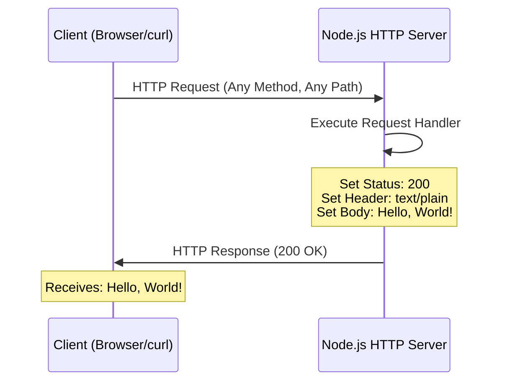

# hao-backprop-test
updated for test

A minimal Node.js HTTP server implementation designed for backprop integration testing. This project demonstrates a simple "Hello, World!" server built with Node.js core modules, requiring zero external dependencies.

## Table of Contents

- [Features](#features)
- [Prerequisites](#prerequisites)
- [Installation](#installation)
- [Quick Start](#quick-start)
- [Usage](#usage)
- [API Reference](#api-reference)
- [How It Works](#how-it-works)
- [Configuration](#configuration)
- [Security](#security)
- [Deployment](#deployment)
- [Testing](#testing)
- [Troubleshooting](#troubleshooting)
- [Development](#development)
- [Contributing](#contributing)
- [License](#license)
- [Author](#author)

## Features

- **Lightweight HTTP Server**: Minimal Node.js implementation using only core modules
- **Zero External Dependencies**: No npm packages required - uses only built-in `http` module
- **Single-File Implementation**: Complete server in one file (`server.js`) - easy to understand
- **Simple Endpoint**: Returns "Hello, World!" response to all requests
- **Easy to Understand**: Perfect for learning Node.js HTTP server basics
- **Easy to Modify**: Clean, straightforward code structure ideal for customization

## Prerequisites

Before running this project, ensure you have the following installed:

- **Node.js**: Version 14.0.0 or higher (tested with v22.21.0)
  - Download from [nodejs.org](https://nodejs.org/)
- **npm**: Comes bundled with Node.js
- **Command Line Knowledge**: Basic familiarity with terminal/command prompt
- **curl** (optional): For testing HTTP endpoints from the command line

### Verify Installation

Check your Node.js and npm versions:

```bash
node --version
# Expected output: v14.0.0 or higher

npm --version
# Expected output: 6.0.0 or higher
```

## Installation

This project has no external dependencies, making installation straightforward:

### Step 1: Clone the Repository

```bash
git clone <repository-url>
cd hao-backprop-test
```

### Step 2: Verify Node.js Installation

```bash
node --version
```

Expected output: `v14.0.0` or higher

### Step 3: Ready to Run

No dependency installation needed! The project uses only Node.js built-in modules.

```bash
# No need to run npm install - there are no dependencies!
```

## Quick Start

Get the server running in three simple commands:

```bash
# 1. Start the server
node server.js

# Output: Server running at http://127.0.0.1:3000/
```

In another terminal window:

```bash
# 2. Test the server
curl http://127.0.0.1:3000/

# 3. Expected output
Hello, World!
```

That's it! Your server is now running and responding to requests.

## Usage

### Starting the Server

Run the server using Node.js:

```bash
node server.js
```

Expected console output:
```
Server running at http://127.0.0.1:3000/
```

The server is now listening on `localhost` (127.0.0.1) at port 3000.

### Stopping the Server

To stop the server, press:

```bash
Ctrl+C
```

(or `Cmd+C` on macOS)

### Changing Port or Hostname

To run on a different port or hostname, modify the constants in `server.js`:

```javascript
const hostname = '127.0.0.1';  // Change to '0.0.0.0' for external access
const port = 3000;              // Change to your preferred port
```

Or set environment variables (requires code modification to read from `process.env`).

## API Reference

### Base URL

```
http://127.0.0.1:3000
```

### Endpoints

| Method | Path | Description | Response |
|--------|------|-------------|----------|
| ALL | `/*` | Returns greeting message | `200 OK`, `text/plain`, `"Hello, World!\n"` |

#### Endpoint: ALL /*

**Description:** Responds with "Hello, World!" to all HTTP requests regardless of method or path.

**Request:**
- **Methods**: GET, POST, PUT, DELETE, etc. (all methods accepted)
- **URL**: Any path (e.g., `/`, `/test`, `/api/users`)
- **Headers**: None required

**Response:**
- **Status Code**: 200 OK  
  *Source: `/server.js:51`*
- **Content-Type**: text/plain  
  *Source: `/server.js:52`*
- **Body**: `Hello, World!\n`  
  *Source: `/server.js:53`*

**Example Requests:**

Using **curl**:
```bash
curl http://127.0.0.1:3000/
# Output: Hello, World!

curl http://127.0.0.1:3000/any/path
# Output: Hello, World!
```

Using **JavaScript fetch**:
```javascript
fetch('http://127.0.0.1:3000/')
  .then(response => response.text())
  .then(data => console.log(data));
// Output: Hello, World!
```

Using a **web browser**:
```
Open: http://127.0.0.1:3000/
Displays: Hello, World!
```

## How It Works

### Architecture Overview

This server implements a simple HTTP request/response cycle using Node.js's built-in `http` module. Every incoming request is handled by a single callback function that sends the same response.

### Request Flow Diagram



### Code Walkthrough

Let's break down `server.js` line by line:

**1. Import the HTTP Module**
```javascript
const http = require('http');
```
Imports Node.js's built-in HTTP module for creating web servers.  
*Source: `/server.js:12`*

**2. Define Server Configuration**
```javascript
const hostname = '127.0.0.1';  // Localhost IPv4 address
const port = 3000;              // Default development port
```
Configures where the server listens. `127.0.0.1` restricts access to the local machine.  
*Source: `/server.js:22,32`*

**3. Create HTTP Server with Request Handler**
```javascript
const server = http.createServer((req, res) => {
  res.statusCode = 200;
  res.setHeader('Content-Type', 'text/plain');
  res.end('Hello, World!\n');
});
```
Creates a server instance with a callback function that:
- Sets HTTP status to 200 (OK)
- Sets response content type to plain text
- Sends "Hello, World!" and closes the connection

*Source: `/server.js:50-54`*

**4. Start Listening for Connections**
```javascript
server.listen(port, hostname, () => {
  console.log(`Server running at http://${hostname}:${port}/`);
});
```
Binds the server to the specified hostname and port, then logs a confirmation message.  
*Source: `/server.js:64-66`*

### Key Concepts

- **Event-Driven Architecture**: Node.js uses callbacks to handle requests asynchronously
- **Single-Threaded**: One process handles all requests using the event loop
- **Stateless Server**: Each request is independent with no session management
- **Simple Response**: Same response for every request regardless of path or method

## Configuration

### Hostname Configuration

**Default Value**: `127.0.0.1` (localhost)  
*Source: `/server.js:22`*

**Options:**
- `127.0.0.1` - Only accessible from local machine (development)
- `0.0.0.0` - Accessible from any network interface (production)
- Specific IP - Bind to a specific network interface

**How to Change:**
Edit `server.js` line 3:
```javascript
const hostname = '0.0.0.0';  // Allow external connections
```

### Port Configuration

**Default Value**: `3000`  
*Source: `/server.js:32`*

**Common Ports:**
- `3000` - Common Node.js development port
- `8000`, `8080` - Alternative development ports
- `80` - HTTP (requires root/admin privileges)
- `443` - HTTPS (requires root/admin privileges)

**How to Change:**
Edit `server.js` line 4:
```javascript
const port = 8080;  // Use port 8080 instead
```

### Environment Variables (Future Enhancement)

To support environment-based configuration, you could modify the code:

```javascript
const hostname = process.env.HOST || '127.0.0.1';
const port = process.env.PORT || 3000;
```

Then run with:
```bash
PORT=8080 HOST=0.0.0.0 node server.js
```

## Security

### Security Overview

This project demonstrates a minimal HTTP server implementation. While suitable for learning and testing, production deployments require additional security measures.

### Current Security Posture

#### Strengths

✅ **Zero External Dependencies**
- No third-party npm packages means zero supply chain attack surface
- No dependency vulnerabilities to patch or monitor
- Reduced risk from compromised packages
- *Source: `/package.json` - no dependencies field*

✅ **Minimal Attack Surface**
- Single-file implementation (~15 lines of code)
- Limited functionality = fewer potential vulnerabilities
- Easy to audit and review for security issues

✅ **Localhost Binding by Default**
- Default `hostname: '127.0.0.1'` restricts access to local machine only
- Prevents unauthorized external network access in development
- *Source: `/server.js:22`*

✅ **Stateless Design**
- No session management or state storage
- No authentication/authorization complexity
- No database connections to secure

#### Current Limitations

⚠️ **No HTTPS/TLS Support**
- Traffic is unencrypted (plain HTTP)
- Vulnerable to man-in-the-middle attacks
- Credentials/sensitive data would be exposed if transmitted

⚠️ **No Input Validation**
- Server accepts all requests without validation
- Suitable for this simple example, but risky for real applications

⚠️ **No Rate Limiting**
- Vulnerable to denial-of-service attacks
- No protection against request flooding

⚠️ **No Security Headers**
- Missing security headers (CSP, HSTS, X-Frame-Options, etc.)
- Browser-side protections not implemented

⚠️ **No Request Logging**
- No audit trail for security monitoring
- Difficult to detect or investigate attacks

### Security Best Practices

#### 1. Network Exposure

**Development (Current Configuration):**
```javascript
const hostname = '127.0.0.1';  // ✅ Secure - localhost only
const port = 3000;              // ✅ Safe - non-privileged port
```

**Production (Requires Careful Configuration):**
```javascript
const hostname = '0.0.0.0';     // ⚠️ Exposes to all network interfaces
const port = process.env.PORT || 3000;
```

**⚠️ Warning:** Binding to `0.0.0.0` makes the server accessible from any network interface. Only use this when:
- Behind a firewall or security group
- Behind a reverse proxy (nginx, Apache)
- In a trusted network environment
- With proper authentication implemented

#### 2. Privileged Ports

**Security Risk:**
```javascript
const port = 80;   // ❌ Requires root/admin privileges
const port = 443;  // ❌ Requires root/admin privileges
```

**Best Practice:**
- **Never run Node.js as root** in production
- Use ports above 1024 (e.g., 3000, 8080, 8443)
- Use a reverse proxy (nginx/Apache) to handle ports 80/443
- Or use port forwarding: `sudo iptables -t nat -A PREROUTING -p tcp --dport 80 -j REDIRECT --to-port 3000`

#### 3. HTTPS/TLS Implementation

For production, implement HTTPS to encrypt traffic:

**Option A: Using Node.js HTTPS Module**
```javascript
const https = require('https');
const fs = require('fs');

const options = {
  key: fs.readFileSync('/path/to/private-key.pem'),
  cert: fs.readFileSync('/path/to/certificate.pem')
};

const server = https.createServer(options, (req, res) => {
  res.statusCode = 200;
  res.setHeader('Content-Type', 'text/plain');
  res.end('Hello, World!\n');
});

server.listen(443, '0.0.0.0', () => {
  console.log('Secure server running at https://0.0.0.0:443/');
});
```

**Option B: Using Reverse Proxy (Recommended)**
- Let nginx or Apache handle TLS termination
- Node.js server runs on localhost port 3000
- Reverse proxy handles SSL certificates, security headers, rate limiting

**Option C: Using Cloud Load Balancer**
- AWS ALB, Azure Application Gateway, GCP Load Balancer
- Managed TLS certificates (AWS Certificate Manager, Let's Encrypt)
- Built-in DDoS protection and WAF capabilities

#### 4. Security Headers

Add security headers to protect against common web vulnerabilities:

```javascript
const server = http.createServer((req, res) => {
  // Prevent clickjacking
  res.setHeader('X-Frame-Options', 'DENY');
  
  // Prevent MIME type sniffing
  res.setHeader('X-Content-Type-Options', 'nosniff');
  
  // Enable XSS protection
  res.setHeader('X-XSS-Protection', '1; mode=block');
  
  // Content Security Policy
  res.setHeader('Content-Security-Policy', "default-src 'self'");
  
  // Referrer Policy
  res.setHeader('Referrer-Policy', 'strict-origin-when-cross-origin');
  
  // Strict Transport Security (HTTPS only)
  // res.setHeader('Strict-Transport-Security', 'max-age=31536000; includeSubDomains');
  
  res.statusCode = 200;
  res.setHeader('Content-Type', 'text/plain');
  res.end('Hello, World!\n');
});
```

#### 5. Rate Limiting and DDoS Protection

Implement rate limiting to prevent abuse:

**Using Express Rate Limit (requires adding dependencies):**
```javascript
// Example only - would require npm install express express-rate-limit
const express = require('express');
const rateLimit = require('express-rate-limit');

const limiter = rateLimit({
  windowMs: 15 * 60 * 1000, // 15 minutes
  max: 100 // limit each IP to 100 requests per windowMs
});

app.use(limiter);
```

**Using Reverse Proxy Rate Limiting:**
- Configure nginx `limit_req_zone` and `limit_req`
- Use cloud provider rate limiting (AWS WAF, Cloudflare)
- Implement IP-based throttling at firewall level

#### 6. Input Validation and Sanitization

While this server doesn't process user input, real applications should:

```javascript
const server = http.createServer((req, res) => {
  // Validate request method
  const allowedMethods = ['GET', 'POST', 'HEAD'];
  if (!allowedMethods.includes(req.method)) {
    res.statusCode = 405;
    res.setHeader('Allow', allowedMethods.join(', '));
    res.end('Method Not Allowed\n');
    return;
  }
  
  // Validate path (prevent directory traversal)
  const url = new URL(req.url, `http://${req.headers.host}`);
  if (url.pathname.includes('..')) {
    res.statusCode = 400;
    res.end('Bad Request\n');
    return;
  }
  
  // Your application logic here
  res.statusCode = 200;
  res.setHeader('Content-Type', 'text/plain');
  res.end('Hello, World!\n');
});
```

#### 7. Security Monitoring and Logging

Implement logging for security monitoring:

```javascript
const server = http.createServer((req, res) => {
  // Log request details
  const timestamp = new Date().toISOString();
  const clientIP = req.socket.remoteAddress;
  const method = req.method;
  const url = req.url;
  const userAgent = req.headers['user-agent'] || 'unknown';
  
  console.log(`[${timestamp}] ${clientIP} ${method} ${url} - ${userAgent}`);
  
  // Your application logic
  res.statusCode = 200;
  res.setHeader('Content-Type', 'text/plain');
  res.end('Hello, World!\n');
  
  // Log response
  console.log(`[${timestamp}] Response: ${res.statusCode}`);
});
```

**Production Logging Best Practices:**
- Use structured logging (JSON format)
- Send logs to centralized logging service (ELK stack, Splunk, CloudWatch)
- Log security events: failed auth attempts, suspicious requests, errors
- Never log sensitive data (passwords, tokens, PII)
- Implement log rotation to prevent disk space issues

#### 8. Environment and Configuration Security

**Secure Configuration Management:**

```bash
# ❌ DON'T hardcode secrets in source code
const API_KEY = 'sk_live_abc123def456';

# ✅ DO use environment variables
const API_KEY = process.env.API_KEY;

# ✅ DO use .env files (and add to .gitignore)
# Create .env file:
echo "API_KEY=sk_live_abc123def456" > .env
echo "DATABASE_URL=postgres://..." >> .env

# Add to .gitignore:
echo ".env" >> .gitignore
```

**Environment Variable Validation:**
```javascript
// Validate required environment variables at startup
const requiredEnvVars = ['API_KEY', 'DATABASE_URL'];
const missing = requiredEnvVars.filter(name => !process.env[name]);

if (missing.length > 0) {
  console.error(`Missing required environment variables: ${missing.join(', ')}`);
  process.exit(1);
}
```

#### 9. Dependency Security (For Future Enhancements)

If you add npm dependencies in the future:

```bash
# Check for known vulnerabilities
npm audit

# Fix automatically where possible
npm audit fix

# Use npm ci for reproducible installs
npm ci

# Keep dependencies updated
npm outdated
npm update

# Use Snyk or Dependabot for automated vulnerability scanning
```

#### 10. Deployment Security Checklist

Before deploying to production:

- [ ] **Remove development configurations** (debug mode, verbose logging)
- [ ] **Use environment variables** for all configuration (no hardcoded values)
- [ ] **Implement HTTPS/TLS** encryption (or use reverse proxy/load balancer)
- [ ] **Add security headers** (CSP, HSTS, X-Frame-Options, etc.)
- [ ] **Implement rate limiting** to prevent DoS attacks
- [ ] **Set up monitoring and alerting** for security events
- [ ] **Configure firewall rules** (allow only necessary ports)
- [ ] **Run as non-root user** (never run Node.js as root)
- [ ] **Enable security groups** (AWS) or network security groups (Azure)
- [ ] **Implement request logging** for audit trails
- [ ] **Set up automated backups** (if applicable)
- [ ] **Use process manager** (PM2, systemd) for automatic restarts
- [ ] **Keep Node.js updated** to latest LTS version
- [ ] **Scan for vulnerabilities** (npm audit, Snyk, etc.)
- [ ] **Implement health checks** and graceful shutdown
- [ ] **Review and minimize exposed endpoints**
- [ ] **Use secrets manager** for sensitive credentials (AWS Secrets Manager, Azure Key Vault)
- [ ] **Enable CORS properly** (don't use `*` in production)
- [ ] **Implement authentication/authorization** if needed
- [ ] **Set up Web Application Firewall (WAF)** for additional protection

### Security Resources

**Node.js Security Best Practices:**
- [Node.js Security Best Practices](https://nodejs.org/en/docs/guides/security/)
- [OWASP Node.js Security Cheat Sheet](https://cheatsheetseries.owasp.org/cheatsheets/Nodejs_Security_Cheat_Sheet.html)
- [Express Security Best Practices](https://expressjs.com/en/advanced/best-practice-security.html)

**Security Tools:**
- [npm audit](https://docs.npmjs.com/cli/v8/commands/npm-audit) - Vulnerability scanning
- [Snyk](https://snyk.io/) - Dependency vulnerability monitoring
- [OWASP ZAP](https://www.zaproxy.org/) - Security testing
- [Let's Encrypt](https://letsencrypt.org/) - Free SSL/TLS certificates

**Security Standards:**
- [OWASP Top 10](https://owasp.org/www-project-top-ten/) - Most critical web security risks
- [CWE Top 25](https://cwe.mitre.org/top25/) - Most dangerous software weaknesses

### Reporting Security Vulnerabilities

If you discover a security vulnerability in this project:

1. **Do NOT create a public GitHub issue**
2. Contact the project maintainer privately
3. Provide detailed information about the vulnerability
4. Allow time for the issue to be addressed before public disclosure

### Disclaimer

This project is designed for **learning and testing purposes**. It is NOT production-ready out of the box. Implementing the security measures described above is YOUR responsibility when deploying to production environments.

## Deployment

### Local Development

**Direct Node.js Execution:**

```bash
node server.js
```

Simple and suitable for development and testing.

### Production Deployment

#### Option 1: Direct Node.js (Basic)

```bash
# Run in foreground
node server.js

# Run in background (Linux/macOS)
nohup node server.js > server.log 2>&1 &
```

**Limitations**: Process stops if terminal closes or errors occur.

#### Option 2: PM2 Process Manager (Recommended)

PM2 keeps your application running, restarts on crashes, and provides monitoring.

```bash
# Install PM2 globally
npm install -g pm2

# Start the server with PM2
pm2 start server.js --name hello-world-server

# View running processes
pm2 list

# View logs
pm2 logs hello-world-server

# Restart
pm2 restart hello-world-server

# Stop
pm2 stop hello-world-server

# Make PM2 start on system boot
pm2 startup
pm2 save
```

#### Option 3: Docker Deployment

**Create a `Dockerfile`:**

```dockerfile
FROM node:18-alpine

WORKDIR /app

COPY server.js .

EXPOSE 3000

CMD ["node", "server.js"]
```

**Build and run:**

```bash
# Build Docker image
docker build -t hello-world-server .

# Run container
docker run -d -p 3000:3000 --name hello-server hello-world-server

# View logs
docker logs hello-server

# Stop container
docker stop hello-server
```

#### Option 4: Cloud Platform Deployment

**Heroku:**

```bash
# Create Heroku app
heroku create

# Add Procfile
echo "web: node server.js" > Procfile

# Deploy
git push heroku main

# Open in browser
heroku open
```

**AWS Elastic Beanstalk:**

1. Install AWS CLI and EB CLI
2. Initialize Elastic Beanstalk:
   ```bash
   eb init -p node.js
   eb create production-env
   eb open
   ```

**Azure App Service:**

1. Install Azure CLI
2. Deploy:
   ```bash
   az webapp up --name hello-world-server --runtime "NODE:18-lts"
   ```

### Environment Considerations

- **Development**: Use `hostname: '127.0.0.1'`, `port: 3000`
- **Production**: Consider `hostname: '0.0.0.0'`, use environment variable for `port`
- **Reverse Proxy**: Use nginx or Apache for production traffic handling
- **Process Manager**: Use PM2 or systemd for automatic restarts
- **Monitoring**: Add logging and error tracking services

## Testing

### Manual Testing with curl

**Test the root endpoint:**
```bash
curl http://127.0.0.1:3000/
```

**Expected output:**
```
Hello, World!
```

**Test with different paths:**
```bash
curl http://127.0.0.1:3000/test
curl http://127.0.0.1:3000/api/users
curl http://127.0.0.1:3000/anything
```

All return: `Hello, World!`

**Test with different HTTP methods:**
```bash
curl -X POST http://127.0.0.1:3000/
curl -X PUT http://127.0.0.1:3000/
curl -X DELETE http://127.0.0.1:3000/
```

All return: `Hello, World!`

**View response headers:**
```bash
curl -i http://127.0.0.1:3000/
```

**Expected output:**
```
HTTP/1.1 200 OK
Content-Type: text/plain
Date: ...
Connection: keep-alive
...

Hello, World!
```

### Browser Testing

1. Start the server: `node server.js`
2. Open a web browser
3. Navigate to: `http://127.0.0.1:3000/`
4. Expected display: `Hello, World!`

### Automated Testing

Currently, no automated test framework is configured. The package.json test script intentionally fails:

```json
"test": "echo \"Error: no test specified\" && exit 1"
```

This is expected behavior. The project is designed as a minimal example without test infrastructure.

### Expected Responses

| Request | Expected Status | Expected Body |
|---------|----------------|---------------|
| Any HTTP method to any path | `200 OK` | `Hello, World!\n` |

## Troubleshooting

### Port Already in Use (EADDRINUSE)

**Error Message:**
```
Error: listen EADDRINUSE: address already in use :::3000
```

**Solution:**

Find and kill the process using port 3000:

```bash
# On macOS/Linux
lsof -i :3000
kill -9 <PID>

# Or use a different port
# Edit server.js and change: const port = 3001;
```

```bash
# On Windows
netstat -ano | findstr :3000
taskkill /PID <PID> /F
```

### Permission Denied (EACCES)

**Error Message:**
```
Error: listen EACCES: permission denied 0.0.0.0:80
```

**Cause:** Ports below 1024 require root/administrator privileges.

**Solutions:**

1. **Use a port above 1024** (recommended):
   ```javascript
   const port = 3000;  // No special privileges needed
   ```

2. **Run with elevated privileges** (not recommended for development):
   ```bash
   sudo node server.js  # Linux/macOS
   ```

3. **Use a reverse proxy**: Run Node.js on port 3000, use nginx on port 80

### Connection Refused (ECONNREFUSED)

**Error when testing:**
```
curl: (7) Failed to connect to 127.0.0.1 port 3000: Connection refused
```

**Possible Causes:**

1. **Server not running**: Start the server with `node server.js`
2. **Wrong hostname**: Verify server is listening on `127.0.0.1`
3. **Wrong port**: Verify server is using port 3000
4. **Firewall blocking**: Check firewall settings

### Module Not Found Errors

**Error Message:**
```
Error: Cannot find module 'http'
```

**Cause:** Extremely rare - indicates Node.js installation issue.

**Solution:**

Reinstall Node.js from [nodejs.org](https://nodejs.org/)

## Development

### Project Structure

```
hao-backprop-test/
├── README.md           # This documentation file
├── package.json        # Project metadata (no dependencies)
├── package-lock.json   # Lock file (empty dependencies)
└── server.js           # Main server implementation (15 lines)
```

**Total Files:** 4  
**Lines of Code:** ~15 lines in `server.js`  
**External Dependencies:** 0

### Making Changes

#### Modify the Response

Edit `server.js` line 9:

```javascript
res.end('Your custom message here!\n');
```

#### Add Basic Routing

Replace the request handler with:

```javascript
const server = http.createServer((req, res) => {
  res.statusCode = 200;
  res.setHeader('Content-Type', 'text/plain');
  
  if (req.url === '/hello') {
    res.end('Hello, World!\n');
  } else if (req.url === '/goodbye') {
    res.end('Goodbye, World!\n');
  } else {
    res.end('Welcome!\n');
  }
});
```

#### Add JSON Response

```javascript
const server = http.createServer((req, res) => {
  res.statusCode = 200;
  res.setHeader('Content-Type', 'application/json');
  res.end(JSON.stringify({ message: 'Hello, World!' }));
});
```

### Code Style Guidelines

- **Formatting**: Use 2-space indentation (current style)
- **Comments**: Add JSDoc comments for functions (recommended)
- **Naming**: Use descriptive variable names
- **Simplicity**: Keep the code minimal and readable
- **Node.js Version**: Maintain compatibility with Node.js 14+

## Contributing

Contributions are welcome! Here's how to contribute to this project:

### How to Contribute

1. **Fork the Repository**
   ```bash
   # Click "Fork" button on GitHub
   ```

2. **Clone Your Fork**
   ```bash
   git clone https://github.com/your-username/hao-backprop-test.git
   cd hao-backprop-test
   ```

3. **Create a Feature Branch**
   ```bash
   git checkout -b feature/your-feature-name
   ```

4. **Make Your Changes**
   - Edit code following the style guidelines
   - Test your changes thoroughly
   - Add documentation for new features

5. **Commit Your Changes**
   ```bash
   git add .
   git commit -m "Add: Description of your changes"
   ```

6. **Push to Your Fork**
   ```bash
   git push origin feature/your-feature-name
   ```

7. **Create a Pull Request**
   - Go to the original repository on GitHub
   - Click "New Pull Request"
   - Select your fork and branch
   - Describe your changes clearly

### Code Standards

- Maintain the minimalist philosophy of the project
- Follow existing code style (2-space indentation)
- Add JSDoc comments for any new functions
- Update README.md if adding new features
- Test all changes before submitting

### Pull Request Process

1. Ensure your code runs without errors
2. Update documentation as needed
3. Reference any related issues in your PR description
4. Wait for review and address any feedback

## License

This project is licensed under the **MIT License**.

**Copyright © 2024**

Permission is hereby granted, free of charge, to any person obtaining a copy of this software and associated documentation files (the "Software"), to deal in the Software without restriction, including without limitation the rights to use, copy, modify, merge, publish, distribute, sublicense, and/or sell copies of the Software, and to permit persons to whom the Software is furnished to do so, subject to the following conditions:

The above copyright notice and this permission notice shall be included in all copies or substantial portions of the Software.

THE SOFTWARE IS PROVIDED "AS IS", WITHOUT WARRANTY OF ANY KIND, EXPRESS OR IMPLIED, INCLUDING BUT NOT LIMITED TO THE WARRANTIES OF MERCHANTABILITY, FITNESS FOR A PARTICULAR PURPOSE AND NONINFRINGEMENT. IN NO EVENT SHALL THE AUTHORS OR COPYRIGHT HOLDERS BE LIABLE FOR ANY CLAIM, DAMAGES OR OTHER LIABILITY, WHETHER IN AN ACTION OF CONTRACT, TORT OR OTHERWISE, ARISING FROM, OUT OF OR IN CONNECTION WITH THE SOFTWARE OR THE USE OR OTHER DEALINGS IN THE SOFTWARE.

*Source: `/package.json:10`*

## Author

**Author:** hxu  
*Source: `/package.json:9`*

**Project:** hao-backprop-test  
**Purpose:** Test project for backprop integration  
**Repository:** [GitHub Repository URL]

---

**Last Updated:** 2024-10-22  
**Documentation Version:** 1.0.0  
**Tested with Node.js:** v22.21.0
