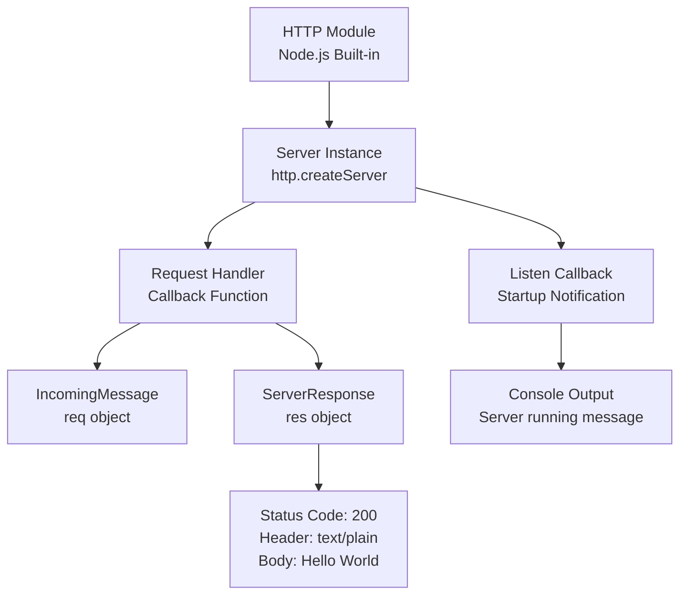
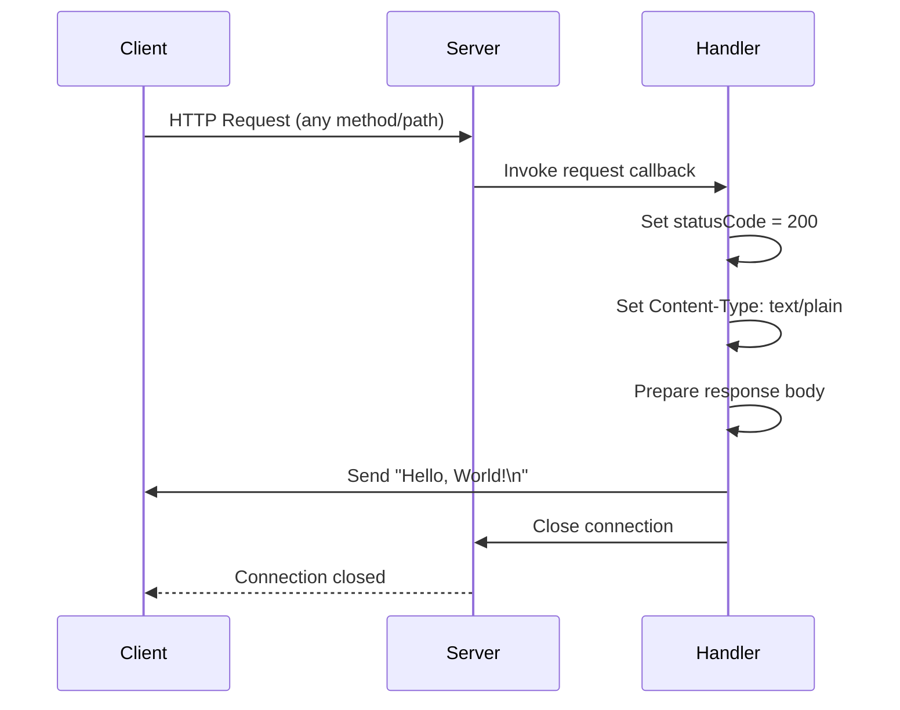
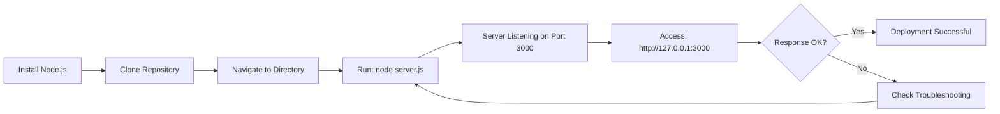

# Node.js Hello World HTTP Server


A minimal HTTP server implementation using Node.js built-in `http` module. This project demonstrates the fundamental concepts of creating a web server in Node.js without any external dependencies. The server binds to localhost (127.0.0.1) on port 3000 and responds to all HTTP requests with a plain text "Hello, World!" message.

This project is ideal for learning Node.js basics, testing deployment configurations, or serving as a template for larger Node.js applications. With zero external dependencies and a simple architecture, it provides a clean starting point for understanding HTTP server mechanics in Node.js.

## Table of Contents

- [Prerequisites](#prerequisites)
- [Installation](#installation)
- [Quick Start](#quick-start)
- [Usage](#usage)
- [API Reference](#api-reference)
- [Configuration](#configuration)
- [Testing](#testing)
- [Deployment](#deployment)
- [Project Structure](#project-structure)
- [Troubleshooting](#troubleshooting)
- [Contributing](#contributing)
- [License](#license)

## Prerequisites

Before running this project, ensure you have the following installed:

- **Node.js**: Version 12.0.0 or higher (tested with v20.19.5)
  - Download from [nodejs.org](https://nodejs.org/)
  - npm is included with Node.js installation
- **Operating System**: Compatible with Windows, macOS, and Linux
- **Optional**: curl for command-line testing (or use a web browser)

Verify your Node.js installation:

```bash
node --version
npm --version
```

## Installation

Follow these steps to set up the project:

1. **Clone or download this repository**:
   ```bash
   git clone <repository-url>
   # Or download and extract the ZIP file
   ```

2. **Navigate to the project directory**:
   ```bash
   cd hello_world
   ```

3. **No dependencies to install**:
   This project uses only Node.js built-in modules, so there's no need to run `npm install`. This is one of the key advantages of this minimal implementation.

4. **Verify setup**:
   Check that `server.js` exists in the directory:
   ```bash
   ls -la
   ```

## Quick Start

Start the server with a single command:

```bash
node server.js
```

**Expected output**:
```
Server running at http://127.0.0.1:3000/
```

**Test the server**:

Using curl:
```bash
curl http://127.0.0.1:3000
```

**Expected response**:
```
Hello, World!
```

Using a web browser, navigate to: `http://127.0.0.1:3000`

**Stop the server**: Press `Ctrl+C` in the terminal

## Usage

### Starting the Server

Run the server using Node.js:

```bash
node server.js
```

The server starts immediately and listens for incoming HTTP requests. You'll see a confirmation message in the console indicating the server is running.

### Accessing the Server

**Via Web Browser**:

1. Open your web browser
2. Navigate to `http://127.0.0.1:3000`
3. You should see "Hello, World!" displayed in the browser

**Via Command Line (curl)**:

```bash
curl http://127.0.0.1:3000
```

**Programmatic Access (Node.js)**:

```javascript
// Using Node.js built-in http module
const http = require('http');

http.get('http://127.0.0.1:3000', (res) => {
  let data = '';
  
  res.on('data', (chunk) => {
    data += chunk;
  });
  
  res.on('end', () => {
    console.log(data); // Output: Hello, World!
  });
}).on('error', (err) => {
  console.error('Error:', err.message);
});
```

**Using modern fetch API (Node.js 18+)**:

```javascript
// Modern approach with fetch
async function testServer() {
  try {
    const response = await fetch('http://127.0.0.1:3000');
    const text = await response.text();
    console.log(text); // Output: Hello, World!
  } catch (error) {
    console.error('Error:', error.message);
  }
}

testServer();
```

### Stopping the Server

To stop the server, press `Ctrl+C` in the terminal where the server is running.

## API Reference

The server responds to all HTTP requests uniformly, regardless of the path or method.

### Endpoint Specification

| Property | Value |
|----------|-------|
| **Base URL** | `http://127.0.0.1:3000` |
| **Paths** | All paths (/, /api, /anything, etc.) |
| **HTTP Methods** | All methods (GET, POST, PUT, DELETE, etc.) |
| **Response Status** | 200 OK |
| **Response Content-Type** | text/plain |
| **Response Body** | "Hello, World!\n" |

### Example Requests

**Using curl**:

```bash
# GET request
curl http://127.0.0.1:3000

# GET request with verbose output
curl -v http://127.0.0.1:3000

# POST request (returns same response)
curl -X POST http://127.0.0.1:3000

# Request to any path (returns same response)
curl http://127.0.0.1:3000/api/users
```

**Using fetch in JavaScript**:

```javascript
fetch('http://127.0.0.1:3000')
  .then(response => response.text())
  .then(data => console.log(data))
  .catch(error => console.error('Error:', error));
```

**Using axios (requires axios installation)**:

```javascript
const axios = require('axios');

axios.get('http://127.0.0.1:3000')
  .then(response => console.log(response.data))
  .catch(error => console.error('Error:', error));
```

### Response Details

**Successful Response**:
```
HTTP/1.1 200 OK
Content-Type: text/plain
Date: <current-date>
Connection: keep-alive
Content-Length: 14

Hello, World!
```

## Configuration

The server can be customized by modifying constants in `server.js` (Source: `/server.js:3-4`).

### Hostname Configuration

**Default**: `127.0.0.1` (localhost only)

To allow access from other machines on your network:

```javascript
// Change line 3 in server.js
const hostname = '0.0.0.0'; // Listen on all network interfaces
```

**Security Consideration**: Using `0.0.0.0` exposes the server to your local network. Only use in trusted environments.

### Port Configuration

**Default**: `3000`

To use a different port:

```javascript
// Change line 4 in server.js
const port = 8080; // Or any port number between 1024-65535
```

**Note**: Ports below 1024 require administrator/root privileges.

### Environment Variable Pattern

For production deployments, use environment variables:

```javascript
// Modify server.js to use environment variables
const hostname = process.env.HOST || '127.0.0.1';
const port = process.env.PORT || 3000;
```

Then start the server with custom values:

```bash
HOST=0.0.0.0 PORT=8080 node server.js
```

### Content-Type Customization

To change the response content type (Source: `/server.js:8`):

```javascript
// Change line 8 in server.js
res.setHeader('Content-Type', 'application/json'); // For JSON
res.setHeader('Content-Type', 'text/html');        // For HTML
```

### Response Message Customization

To change the response message (Source: `/server.js:9`):

```javascript
// Change line 9 in server.js
res.end('Custom response message\n');
res.end(JSON.stringify({ message: 'Hello, World!' })); // For JSON
```

## Testing

### Manual Testing with curl

**Basic connectivity test**:
```bash
curl http://127.0.0.1:3000
```

**Expected output**: `Hello, World!`

**Verbose test with headers**:
```bash
curl -v http://127.0.0.1:3000
```

**Expected**: Status code 200, Content-Type: text/plain

**Test different paths**:
```bash
curl http://127.0.0.1:3000/
curl http://127.0.0.1:3000/test
curl http://127.0.0.1:3000/api/endpoint
```

All should return: `Hello, World!`

### Browser Testing

1. Start the server: `node server.js`
2. Open a web browser
3. Navigate to: `http://127.0.0.1:3000`
4. **Expected**: Browser displays "Hello, World!"
5. Try different paths (all return the same response)

### Programmatic Testing

Create a test script `test-server.js`:

```javascript
const http = require('http');

// Test function
function testServer() {
  return new Promise((resolve, reject) => {
    http.get('http://127.0.0.1:3000', (res) => {
      let data = '';
      
      // Check status code
      if (res.statusCode !== 200) {
        reject(new Error(`Expected status 200, got ${res.statusCode}`));
        return;
      }
      
      // Check content type
      if (res.headers['content-type'] !== 'text/plain') {
        reject(new Error(`Unexpected content-type: ${res.headers['content-type']}`));
        return;
      }
      
      // Collect response data
      res.on('data', (chunk) => {
        data += chunk;
      });
      
      // Validate response
      res.on('end', () => {
        if (data === 'Hello, World!\n') {
          console.log('✓ Test passed: Server responded correctly');
          resolve(data);
        } else {
          reject(new Error(`Unexpected response: ${data}`));
        }
      });
    }).on('error', (err) => {
      reject(err);
    });
  });
}

// Run test
testServer()
  .then(() => console.log('All tests passed!'))
  .catch(err => console.error('Test failed:', err.message));
```

Run the test:
```bash
# Ensure server is running first
node server.js &

# Run test
node test-server.js

# Stop background server
killall node
```

## Deployment

### Local Development Deployment

For local development, follow the [Quick Start](#quick-start) instructions:

```bash
node server.js
```

The server is immediately available at `http://127.0.0.1:3000`.

### Production Deployment Considerations

#### 1. Network Accessibility

Change the hostname to allow external connections:

```javascript
// In server.js, line 3
const hostname = '0.0.0.0'; // Bind to all network interfaces
```

Or use environment variables:

```javascript
const hostname = process.env.HOST || '0.0.0.0';
const port = process.env.PORT || 3000;
```

#### 2. Process Management

**Using PM2** (Process Manager):

```bash
# Install PM2 globally
npm install -g pm2

# Start server with PM2
pm2 start server.js --name "hello-world-server"

# View status
pm2 status

# View logs
pm2 logs hello-world-server

# Stop server
pm2 stop hello-world-server

# Restart server
pm2 restart hello-world-server

# Enable startup on system boot
pm2 startup
pm2 save
```

**Using systemd** (Linux):

Create `/etc/systemd/system/hello-world.service`:

```ini
[Unit]
Description=Hello World Node.js Server
After=network.target

[Service]
Type=simple
User=www-data
WorkingDirectory=/path/to/hello_world
ExecStart=/usr/bin/node server.js
Restart=on-failure
Environment=NODE_ENV=production
Environment=PORT=3000

[Install]
WantedBy=multi-user.target
```

Enable and start:

```bash
sudo systemctl enable hello-world
sudo systemctl start hello-world
sudo systemctl status hello-world
```

#### 3. Reverse Proxy Setup

**Using nginx**:

```nginx
server {
    listen 80;
    server_name example.com;

    location / {
        proxy_pass http://127.0.0.1:3000;
        proxy_http_version 1.1;
        proxy_set_header Upgrade $http_upgrade;
        proxy_set_header Connection 'upgrade';
        proxy_set_header Host $host;
        proxy_cache_bypass $http_upgrade;
        proxy_set_header X-Real-IP $remote_addr;
        proxy_set_header X-Forwarded-For $proxy_add_x_forwarded_for;
        proxy_set_header X-Forwarded-Proto $scheme;
    }
}
```

**Using Apache**:

```apache
<VirtualHost *:80>
    ServerName example.com
    
    ProxyPreserveHost On
    ProxyPass / http://127.0.0.1:3000/
    ProxyPassReverse / http://127.0.0.1:3000/
</VirtualHost>
```

#### 4. HTTPS/TLS Configuration

For production, always use HTTPS. Use Let's Encrypt with certbot:

```bash
# Install certbot
sudo apt-get install certbot python3-certbot-nginx

# Obtain certificate (for nginx)
sudo certbot --nginx -d example.com

# Auto-renewal is configured automatically
```

### Cloud Deployment Examples

#### Heroku

```bash
# Create Procfile
echo "web: node server.js" > Procfile

# Modify server.js to use Heroku's PORT
# const port = process.env.PORT || 3000;

# Deploy
heroku create
git push heroku main
```

#### AWS EC2

```bash
# SSH into EC2 instance
ssh -i key.pem ubuntu@<ec2-ip>

# Install Node.js
curl -fsSL https://deb.nodesource.com/setup_20.x | sudo -E bash -
sudo apt-get install -y nodejs

# Clone repository
git clone <repo-url>
cd hello_world

# Run with PM2
npm install -g pm2
pm2 start server.js
pm2 save
pm2 startup
```

#### DigitalOcean

1. Create a Droplet with Node.js
2. SSH into the droplet
3. Clone the repository
4. Follow PM2 or systemd setup above
5. Configure firewall to allow port 3000 or use nginx

## Project Structure

```
hello_world/
├── server.js           # Main HTTP server implementation
├── package.json        # Project metadata and configuration
├── package-lock.json   # Dependency lock file (auto-generated)
└── README.md          # This documentation file
```

### File Descriptions

| File | Purpose | Source |
|------|---------|--------|
| **server.js** | Core HTTP server implementation using Node.js `http` module. Contains server configuration (hostname, port) and request handler logic. | `/server.js:1-14` |
| **package.json** | Project metadata including name, version, description, author, and license. Defines the project entry point and npm scripts. | `/package.json:1-11` |
| **package-lock.json** | Auto-generated file that locks dependency versions (currently empty as project has no dependencies). | N/A |
| **README.md** | Comprehensive project documentation including setup, usage, API reference, and deployment instructions. | This file |

### Minimal Structure Advantages

- **No Dependencies**: Zero npm packages means no security vulnerabilities from third-party code
- **Fast Setup**: No `npm install` required, server runs immediately
- **Easy Maintenance**: Only one source file to maintain and understand
- **Small Footprint**: Entire project is less than 1KB of code
- **Educational Value**: Simple enough to understand every line
- **Portability**: Runs anywhere Node.js is installed

### Architecture Diagram



### Request/Response Flow



### Deployment Process Flow



## Troubleshooting

### Common Issues and Solutions

#### Issue: Port 3000 Already in Use

**Error Message**:
```
Error: listen EADDRINUSE: address already in use :::3000
```

**Solution**:

1. **Find the process using port 3000**:
   ```bash
   # On macOS/Linux
   lsof -i :3000
   
   # On Windows
   netstat -ano | findstr :3000
   ```

2. **Kill the process** or change the port in `server.js`:
   ```javascript
   const port = 3001; // Use a different port
   ```

#### Issue: EACCES Permission Denied

**Error Message**:
```
Error: listen EACCES: permission denied 0.0.0.0:80
```

**Solution**:

Ports below 1024 require elevated privileges. Either:

1. **Use a port above 1024** (recommended):
   ```javascript
   const port = 3000; // Or any port >= 1024
   ```

2. **Run with sudo** (not recommended for development):
   ```bash
   sudo node server.js
   ```

3. **Use a reverse proxy** (recommended for production) like nginx to forward port 80 to 3000

#### Issue: Cannot Access Server from Other Machines

**Symptom**: Server works on localhost but not from other computers on the network

**Solution**:

Change the hostname to bind to all network interfaces:

```javascript
// In server.js, line 3
const hostname = '0.0.0.0';
```

Also ensure:
- Firewall allows connections on port 3000
- You're using the correct IP address (not 127.0.0.1) from other machines

```bash
# Find your local IP address
# On macOS/Linux
ifconfig | grep "inet "

# On Windows
ipconfig
```

Access from other machines using: `http://<your-ip>:3000`

#### Issue: Node.js Not Found

**Error Message**:
```
bash: node: command not found
```

**Solution**:

1. **Verify Node.js installation**:
   ```bash
   node --version
   ```

2. **If not installed**, download from [nodejs.org](https://nodejs.org/)

3. **Add Node.js to PATH** if installed but not found:
   ```bash
   # Add to ~/.bashrc or ~/.zshrc
   export PATH="/usr/local/bin:$PATH"
   ```

4. **Restart terminal** and try again

#### Issue: Server Stops When Terminal Closes

**Symptom**: Server stops running when you close the terminal or SSH session

**Solution**:

Use a process manager:

```bash
# Option 1: Use PM2
npm install -g pm2
pm2 start server.js

# Option 2: Use nohup
nohup node server.js &

# Option 3: Use screen
screen -S server
node server.js
# Press Ctrl+A then D to detach
```

## Contributing

We welcome contributions to improve this project! Here's how you can help:

### Reporting Issues

If you encounter any problems:

1. Check the [Troubleshooting](#troubleshooting) section first
2. Search existing issues on the repository
3. If not found, open a new issue with:
   - Clear description of the problem
   - Steps to reproduce
   - Expected vs actual behavior
   - Your environment (Node.js version, OS)

### Submitting Improvements

1. **Fork the repository**
2. **Create a feature branch**:
   ```bash
   git checkout -b feature/your-feature-name
   ```
3. **Make your changes**
4. **Test thoroughly**:
   - Ensure server starts without errors
   - Verify response is correct
   - Test with curl and browser
5. **Commit with clear messages**:
   ```bash
   git commit -m "Add: brief description of changes"
   ```
6. **Push to your fork**:
   ```bash
   git push origin feature/your-feature-name
   ```
7. **Open a Pull Request** with:
   - Description of changes
   - Reasoning behind the changes
   - Any testing performed

### Code Style Guidelines

- Use 2-space indentation (existing style in server.js)
- Follow Node.js best practices
- Keep the codebase minimal and focused
- Add comments for complex logic
- Maintain zero external dependencies philosophy

### Testing Requirements

Before submitting changes:

- [ ] Server starts successfully with `node server.js`
- [ ] curl test returns expected response
- [ ] Browser access works correctly
- [ ] No console errors or warnings
- [ ] Documentation updated if behavior changes

## License

This project is licensed under the **MIT License**.

```
MIT License

Copyright (c) 2024 hxu

Permission is hereby granted, free of charge, to any person obtaining a copy
of this software and associated documentation files (the "Software"), to deal
in the Software without restriction, including without limitation the rights
to use, copy, modify, merge, publish, distribute, sublicense, and/or sell
copies of the Software, and to permit persons to whom the Software is
furnished to do so, subject to the following conditions:

The above copyright notice and this permission notice shall be included in all
copies or substantial portions of the Software.

THE SOFTWARE IS PROVIDED "AS IS", WITHOUT WARRANTY OF ANY KIND, EXPRESS OR
IMPLIED, INCLUDING BUT NOT LIMITED TO THE WARRANTIES OF MERCHANTABILITY,
FITNESS FOR A PARTICULAR PURPOSE AND NONINFRINGEMENT. IN NO EVENT SHALL THE
AUTHORS OR COPYRIGHT HOLDERS BE LIABLE FOR ANY CLAIM, DAMAGES OR OTHER
LIABILITY, WHETHER IN AN ACTION OF CONTRACT, TORT OR OTHERWISE, ARISING FROM,
OUT OF OR IN CONNECTION WITH THE SOFTWARE OR THE USE OR OTHER DEALINGS IN THE
SOFTWARE.
```

**Source**: `/package.json:10`

---

**Documentation Version**: 1.0.0  
**Last Updated**: 2024  
**Project Repository**: [Link to repository if applicable]  

For more information about Node.js, visit [nodejs.org](https://nodejs.org/)