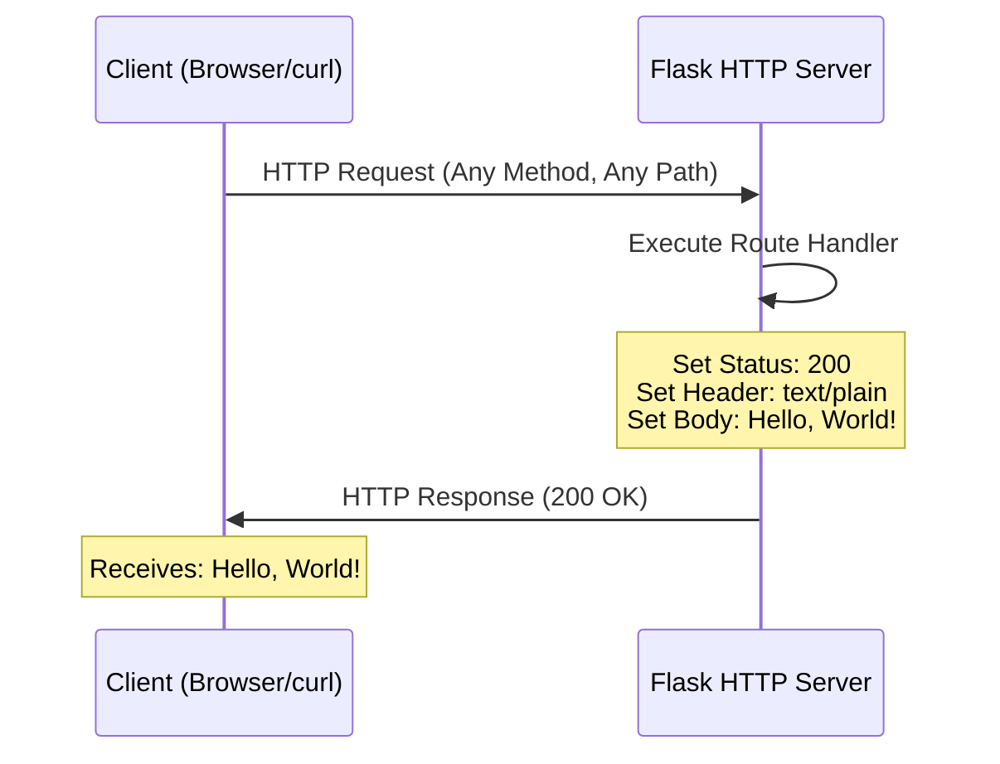

# hao-backprop-test
updated for test

A minimal Python Flask HTTP server implementation designed for backprop integration testing. This project demonstrates a simple "Hello, World!" server built with the Flask micro-framework with minimal dependencies.

## Table of Contents

- [Features](#features)
- [Prerequisites](#prerequisites)
- [Installation](#installation)
- [Quick Start](#quick-start)
- [Usage](#usage)
- [API Reference](#api-reference)
- [How It Works](#how-it-works)
- [Configuration](#configuration)
- [Deployment](#deployment)
- [Testing](#testing)
- [Troubleshooting](#troubleshooting)
- [Development](#development)
- [Contributing](#contributing)
- [License](#license)
- [Author](#author)

## Features

- **Lightweight HTTP Server**: Minimal Python Flask implementation
- **Minimal Dependencies**: Uses only Flask micro-framework
- **Single-File Implementation**: Complete server in one file (`app.py`) - easy to understand
- **Simple Endpoint**: Returns "Hello, World!" response to all requests
- **Easy to Understand**: Perfect for learning Flask HTTP server basics
- **Easy to Modify**: Clean, straightforward code structure ideal for customization

## Prerequisites

Before running this project, ensure you have the following installed:

- **Python**: Version 3.8 or higher (tested with 3.12.3)
  - Download from [python.org](https://www.python.org/)
- **pip**: Comes bundled with Python
- **Command Line Knowledge**: Basic familiarity with terminal/command prompt
- **curl** (optional): For testing HTTP endpoints from the command line

### Verify Installation

Check your Python and pip versions:

```bash
python --version
# Expected output: Python 3.8.0 or higher

pip --version
# Expected output: pip 20.0.0 or higher
```

## Installation

This project requires minimal dependencies (Flask), making installation straightforward:

### Step 1: Clone the Repository

```bash
git clone <repository-url>
cd hao-backprop-test
```

### Step 2: Verify Python Installation

```bash
python --version
```

Expected output: `Python 3.8.0` or higher

### Step 3: Install Dependencies

Create a virtual environment (recommended) and install the required packages:

```bash
# Create and activate virtual environment (optional but recommended)
python -m venv venv
source venv/bin/activate  # On Windows: venv\Scripts\activate

# Install dependencies
pip install -r requirements.txt
```

## Quick Start

Get the server running in three simple commands:

```bash
# 1. Start the server
python app.py

# Output: Server running at http://127.0.0.1:3000/
```

In another terminal window:

```bash
# 2. Test the server
curl http://127.0.0.1:3000/

# 3. Expected output
Hello, World!
```

That's it! Your server is now running and responding to requests.

## Usage

### Starting the Server

Run the server using Python:

```bash
python app.py
```

Expected console output:
```
Server running at http://127.0.0.1:3000/
```

The server is now listening on `localhost` (127.0.0.1) at port 3000.

### Stopping the Server

To stop the server, press:

```bash
Ctrl+C
```

(or `Cmd+C` on macOS)

### Changing Port or Hostname

To run on a different port or hostname, modify the constants in `app.py`:

```python
HOSTNAME = '127.0.0.1'  # Change to '0.0.0.0' for external access
PORT = 3000              # Change to your preferred port
```

Or set environment variables before running the server:

```bash
PORT=8080 HOST=0.0.0.0 python app.py
```

## API Reference

### Base URL

```
http://127.0.0.1:3000
```

### Endpoints

| Method | Path | Description | Response |
|--------|------|-------------|----------|
| ALL | `/*` | Returns greeting message | `200 OK`, `text/plain`, `"Hello, World!\n"` |

#### Endpoint: ALL /*

**Description:** Responds with "Hello, World!" to all HTTP requests regardless of method or path.

**Request:**
- **Methods**: GET, POST, PUT, DELETE, etc. (all methods accepted)
- **URL**: Any path (e.g., `/`, `/test`, `/api/users`)
- **Headers**: None required

**Response:**
- **Status Code**: 200 OK  
  *Source: `/app.py`*
- **Content-Type**: text/plain  
  *Source: `/app.py`*
- **Body**: `Hello, World!\n`  
  *Source: `/app.py`*

**Example Requests:**

Using **curl**:
```bash
curl http://127.0.0.1:3000/
# Output: Hello, World!

curl http://127.0.0.1:3000/any/path
# Output: Hello, World!
```

Using **Python requests**:
```python
import requests

response = requests.get('http://127.0.0.1:3000/')
print(response.text)
# Output: Hello, World!
```

Using a **web browser**:
```
Open: http://127.0.0.1:3000/
Displays: Hello, World!
```

## How It Works

### Architecture Overview

This server implements a simple HTTP request/response cycle using the Flask micro-framework. Every incoming request is handled by a single route handler function that sends the same response.

### Request Flow Diagram



### Code Walkthrough

Let's break down `app.py` line by line:

**1. Import Flask**
```python
from flask import Flask, Response
import os
```
Imports Flask framework classes for creating the web server and building responses, and the `os` module for environment variable access.  
*Source: `/app.py`*

**2. Define Server Configuration**
```python
HOSTNAME = os.getenv('HOST', '127.0.0.1')  # Localhost IPv4 address
PORT = int(os.getenv('PORT', 3000))          # Default development port
```
Configures where the server listens with support for environment variable overrides. `127.0.0.1` restricts access to the local machine.  
*Source: `/app.py`*

**3. Create Flask Application and Route Handler**
```python
app = Flask(__name__)

@app.route('/', defaults={'path': ''})
@app.route('/<path:path>')
def hello_world(path):
    return Response('Hello, World!\n', status=200, mimetype='text/plain')
```
Creates a Flask application instance and defines a catch-all route handler that:
- Matches all URL paths (root and any sub-path)
- Returns HTTP status 200 (OK)
- Sets response content type to plain text
- Sends "Hello, World!" as the response body

*Source: `/app.py`*

**4. Start the Server**
```python
if __name__ == '__main__':
    print(f'Server running at http://{HOSTNAME}:{PORT}/')
    app.run(host=HOSTNAME, port=PORT, debug=True)
```
Prints a startup message and starts the Flask development server on the configured hostname and port.  
*Source: `/app.py`*

### Key Concepts

- **Decorator-Based Routing**: Flask uses `@app.route()` decorators to map URLs to handler functions
- **WSGI Server**: Flask uses Werkzeug's WSGI server for handling HTTP connections
- **Stateless Server**: Each request is independent with no session management
- **Simple Response**: Same response for every request regardless of path or method

## Configuration

### Hostname Configuration

**Default Value**: `127.0.0.1` (localhost)  
*Source: `/app.py`*

**Options:**
- `127.0.0.1` - Only accessible from local machine (development)
- `0.0.0.0` - Accessible from any network interface (production)
- Specific IP - Bind to a specific network interface

**How to Change:**
Edit `app.py` and update the `HOSTNAME` constant:
```python
HOSTNAME = '0.0.0.0'  # Allow external connections
```

### Port Configuration

**Default Value**: `3000`  
*Source: `/app.py`*

**Common Ports:**
- `3000` - Common development port
- `8000`, `8080` - Alternative development ports
- `80` - HTTP (requires root/admin privileges)
- `443` - HTTPS (requires root/admin privileges)

**How to Change:**
Edit `app.py` and update the `PORT` constant:
```python
PORT = 8080  # Use port 8080 instead
```

### Environment Variables

The server supports environment variable configuration out of the box:

```python
HOSTNAME = os.getenv('HOST', '127.0.0.1')
PORT = int(os.getenv('PORT', 3000))
```

Run with custom settings:
```bash
PORT=8080 HOST=0.0.0.0 python app.py
```

## Deployment

### Local Development

**Direct Python Execution:**

```bash
python app.py
```

Simple and suitable for development and testing.

### Production Deployment

#### Option 1: Direct Python (Basic)

```bash
# Run in foreground
python app.py

# Run in background (Linux/macOS)
nohup python app.py > server.log 2>&1 &
```

**Limitations**: Process stops if terminal closes or errors occur.

#### Option 2: Gunicorn WSGI Server (Recommended)

Gunicorn is a production-grade WSGI server that provides worker management, graceful restarts, and monitoring.

```bash
# Install Gunicorn
pip install gunicorn

# Start the server with Gunicorn (4 worker processes)
gunicorn -w 4 -b 127.0.0.1:3000 app:app

# Run in background
gunicorn -w 4 -b 127.0.0.1:3000 app:app --daemon

# Run with access logging
gunicorn -w 4 -b 127.0.0.1:3000 app:app --access-logfile server.log

# Stop (find and kill the process)
pkill gunicorn
```

#### Option 3: Docker Deployment

**Create a `Dockerfile`:**

```dockerfile
FROM python:3.12-slim

WORKDIR /app

COPY requirements.txt .
RUN pip install --no-cache-dir -r requirements.txt

COPY app.py .

EXPOSE 3000

CMD ["python", "app.py"]
```

**Build and run:**

```bash
# Build Docker image
docker build -t hello-world-server .

# Run container
docker run -d -p 3000:3000 --name hello-server hello-world-server

# View logs
docker logs hello-server

# Stop container
docker stop hello-server
```

#### Option 4: Cloud Platform Deployment

**Heroku:**

```bash
# Create Heroku app
heroku create

# Add Procfile
echo "web: gunicorn app:app" > Procfile

# Add runtime.txt
echo "python-3.12.3" > runtime.txt

# Deploy
git push heroku main

# Open in browser
heroku open
```

**AWS Elastic Beanstalk:**

1. Install AWS CLI and EB CLI
2. Initialize Elastic Beanstalk:
   ```bash
   eb init -p python-3.12
   eb create production-env
   eb open
   ```

**Azure App Service:**

1. Install Azure CLI
2. Deploy:
   ```bash
   az webapp up --name hello-world-server --runtime "PYTHON:3.12"
   ```

### Environment Considerations

- **Development**: Use `HOSTNAME = '127.0.0.1'`, `PORT = 3000`
- **Production**: Consider `HOSTNAME = '0.0.0.0'`, use environment variable for `PORT`
- **Reverse Proxy**: Use nginx or Apache for production traffic handling
- **Process Manager**: Use Gunicorn, uWSGI, or systemd for automatic restarts
- **Monitoring**: Add logging and error tracking services

## Testing

### Manual Testing with curl

**Test the root endpoint:**
```bash
curl http://127.0.0.1:3000/
```

**Expected output:**
```
Hello, World!
```

**Test with different paths:**
```bash
curl http://127.0.0.1:3000/test
curl http://127.0.0.1:3000/api/users
curl http://127.0.0.1:3000/anything
```

All return: `Hello, World!`

**Test with different HTTP methods:**
```bash
curl -X POST http://127.0.0.1:3000/
curl -X PUT http://127.0.0.1:3000/
curl -X DELETE http://127.0.0.1:3000/
```

All return: `Hello, World!`

**View response headers:**
```bash
curl -i http://127.0.0.1:3000/
```

**Expected output:**
```
HTTP/1.1 200 OK
Content-Type: text/plain
Date: ...
Connection: keep-alive
...

Hello, World!
```

### Browser Testing

1. Start the server: `python app.py`
2. Open a web browser
3. Navigate to: `http://127.0.0.1:3000/`
4. Expected display: `Hello, World!`

### Expected Responses

| Request | Expected Status | Expected Body |
|---------|----------------|---------------|
| Any HTTP method to any path | `200 OK` | `Hello, World!\n` |

## Troubleshooting

### Port Already in Use

**Error Message:**
```
OSError: [Errno 98] Address already in use
```

**Solution:**

Find and kill the process using port 3000:

```bash
# On macOS/Linux
lsof -i :3000
kill -9 <PID>

# Or use a different port
# Edit app.py and change: PORT = 3001
```

```bash
# On Windows
netstat -ano | findstr :3000
taskkill /PID <PID> /F
```

### Permission Denied

**Error Message:**
```
PermissionError: [Errno 13] Permission denied
```

**Cause:** Ports below 1024 require root/administrator privileges.

**Solutions:**

1. **Use a port above 1024** (recommended):
   ```python
   PORT = 3000  # No special privileges needed
   ```

2. **Run with elevated privileges** (not recommended for development):
   ```bash
   sudo python app.py  # Linux/macOS
   ```

3. **Use a reverse proxy**: Run Flask on port 3000, use nginx on port 80

### Connection Refused

**Error when testing:**
```
curl: (7) Failed to connect to 127.0.0.1 port 3000: Connection refused
```

**Possible Causes:**

1. **Server not running**: Start the server with `python app.py`
2. **Wrong hostname**: Verify server is listening on `127.0.0.1`
3. **Wrong port**: Verify server is using port 3000
4. **Firewall blocking**: Check firewall settings

### Module Not Found Errors

**Error Message:**
```
ModuleNotFoundError: No module named 'flask'
```

**Cause:** Flask is not installed in the current Python environment.

**Solution:**

Install the required dependencies:
```bash
pip install -r requirements.txt
```

## Development

### Project Structure

```
hao-backprop-test/
├── README.md           # This documentation file
├── requirements.txt    # Python package dependencies (Flask)
├── .python-version     # Python version specification
└── app.py              # Main server implementation
```

**Total Files:** 4  
**Lines of Code:** ~60 lines in `app.py`  
**External Dependencies:** 1 (Flask)

### Making Changes

#### Modify the Response

Edit the `hello_world` function in `app.py`:

```python
return Response('Your custom message here!\n', status=200, mimetype='text/plain')
```

#### Add Basic Routing

Replace the route handlers with:

```python
@app.route('/hello')
def hello():
    return Response('Hello, World!\n', status=200, mimetype='text/plain')

@app.route('/goodbye')
def goodbye():
    return Response('Goodbye, World!\n', status=200, mimetype='text/plain')

@app.route('/', defaults={'path': ''})
@app.route('/<path:path>')
def welcome(path):
    return Response('Welcome!\n', status=200, mimetype='text/plain')
```

#### Add JSON Response

```python
from flask import Flask, jsonify

@app.route('/', defaults={'path': ''})
@app.route('/<path:path>')
def hello_world(path):
    return jsonify(message='Hello, World!')
```

### Code Style Guidelines

- **Formatting**: Use 4-space indentation (PEP 8)
- **Comments**: Add Python docstrings for functions (PEP 257)
- **Naming**: Use descriptive variable names
- **Simplicity**: Keep the code minimal and readable
- **Python Version**: Maintain compatibility with Python 3.8+

## Contributing

Contributions are welcome! Here's how to contribute to this project:

### How to Contribute

1. **Fork the Repository**
   ```bash
   # Click "Fork" button on GitHub
   ```

2. **Clone Your Fork**
   ```bash
   git clone https://github.com/your-username/hao-backprop-test.git
   cd hao-backprop-test
   ```

3. **Create a Feature Branch**
   ```bash
   git checkout -b feature/your-feature-name
   ```

4. **Make Your Changes**
   - Edit code following the style guidelines
   - Test your changes thoroughly
   - Add documentation for new features

5. **Commit Your Changes**
   ```bash
   git add .
   git commit -m "Add: Description of your changes"
   ```

6. **Push to Your Fork**
   ```bash
   git push origin feature/your-feature-name
   ```

7. **Create a Pull Request**
   - Go to the original repository on GitHub
   - Click "New Pull Request"
   - Select your fork and branch
   - Describe your changes clearly

### Code Standards

- Maintain the minimalist philosophy of the project
- Follow PEP 8 style guide (4-space indentation)
- Add Python docstrings for any new functions (PEP 257)
- Update README.md if adding new features
- Test all changes before submitting

### Pull Request Process

1. Ensure your code runs without errors
2. Update documentation as needed
3. Reference any related issues in your PR description
4. Wait for review and address any feedback

## License

This project is licensed under the **MIT License**.

**Copyright © 2024**

Permission is hereby granted, free of charge, to any person obtaining a copy of this software and associated documentation files (the "Software"), to deal in the Software without restriction, including without limitation the rights to use, copy, modify, merge, publish, distribute, sublicense, and/or sell copies of the Software, and to permit persons to whom the Software is furnished to do so, subject to the following conditions:

The above copyright notice and this permission notice shall be included in all copies or substantial portions of the Software.

THE SOFTWARE IS PROVIDED "AS IS", WITHOUT WARRANTY OF ANY KIND, EXPRESS OR IMPLIED, INCLUDING BUT NOT LIMITED TO THE WARRANTIES OF MERCHANTABILITY, FITNESS FOR A PARTICULAR PURPOSE AND NONINFRINGEMENT. IN NO EVENT SHALL THE AUTHORS OR COPYRIGHT HOLDERS BE LIABLE FOR ANY CLAIM, DAMAGES OR OTHER LIABILITY, WHETHER IN AN ACTION OF CONTRACT, TORT OR OTHERWISE, ARISING FROM, OUT OF OR IN CONNECTION WITH THE SOFTWARE OR THE USE OR OTHER DEALINGS IN THE SOFTWARE.

*Source: `/requirements.txt`*

## Author

**Author:** hxu  
*Source: `/requirements.txt`*

**Project:** hao-backprop-test  
**Purpose:** Test project for backprop integration  
**Repository:** [GitHub Repository URL]

---

**Last Updated:** 2024-10-22  
**Documentation Version:** 1.0.0  
**Tested with Python:** 3.12.3
